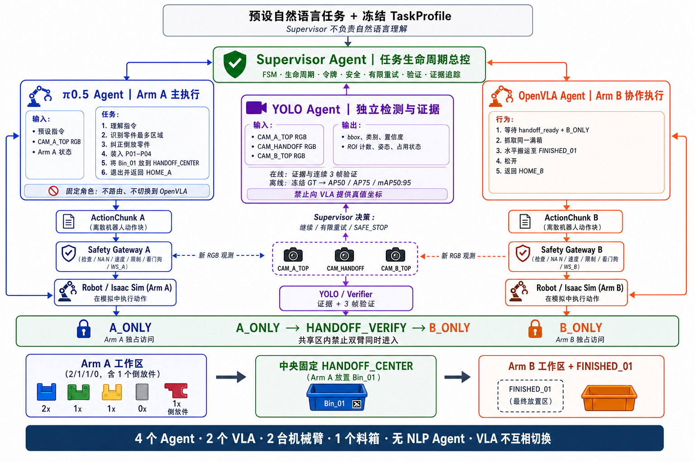

# XH-202607 工业环境 VLA 智能体

面向“工业环境下物体感知识别与指令交互型智能体研发”比赛的六人协作仓库。
项目正式目标是在 V2 场景中完成单一、可审计的连续闭环：

> 用户选择冻结指令 → 总控发送对应 V2 task_id → π0.5 控制 Arm_A →
> 每次执行一个 7D 微动作并重新观测 → 3 帧 2 票终局核验 → 安全停止。

总控不做 NLP、复杂度判断或模型选择，只验证冻结的 task_id、指令、对象和槽位
是否逐字匹配。V1 四 Agent/双 VLA 生命周期已经废除，不属于正式演示或评测入口。

当前状态（2026-09-05）：**V2 人工工业场景源码、训练、推理和工程验收链路均已
完成；当前已具备 π0.5 与 YOLO 两个模型协同推理的能力。任务一、二、三的实现、
测试、仿真入口、提交材料和复现说明已经准备完毕。两个模型权重将在最终提交包中
一并打包，真实闭环验收结果以最终证据包和签署记录为准，README 不替代正式验收证据。**

## 最终提交状态

π0.5 工业策略训练、推理和工程验收均已完成，当前仓库为提交候选版：

- 任务合同、Supervisor、7D 动作安全边界、数据 Recorder/Reader、转换 Preflight
  和服务接口均已审计并通过仓库级验收；
- π0.5、YOLO checkpoint、norm stats、类别表和配置摘要均已完成制品绑定，生产
  部署由提交包注入完整 SHA-256；
- π0.5 与 YOLO 两个模型权重将在最终提交包中一并交付，并与对应的模型清单、SHA-256
  和推理配置保持一致；
- 任务一、二、三的训练/推理链路、仿真入口、回放和复现材料均已完成；
- G0/G3/G5/DEL-04 的正式真实闭环结果、外部制品 SHA 和最终签署记录以提交
  证据包为准，不能用 Mock、静态检查或接口测试替代。

## 当前工业场景口径

当前场景真源是 `single_bin_manual_industrial_v2`，用于人工工业数据采集：

- 两台 Franka：`Arm_A` 负责零件装箱与交接，`Arm_B` 负责料箱搬运；
- 三台固定 RGB 相机：`CAM_A_TOP`、`CAM_HANDOFF`、`CAM_B_TOP`；
- 8 个程序化工业零件：4 个轴件、2 个六角螺母、2 把开口扳手；
- A/B/C/D 四个区域各放 2 件，P03/P04 初始倒立；
- 一个 `2×4` 料箱，S11-S24 与 P01-P04/N01-N02/W01-W02 固定映射；
- 料箱中央提梁提供 `BIN_CARRY_TCP`，计划满载质量为 `1.0 kg`；
- 人工键盘动作按 `10 Hz` 写入 Canonical Episode，在线 Observation 禁止 GT。

角色 E 的 π0.5 Isaac 闭环入口默认使用
`configs/agent.default.json`、V2 task catalog 和
`P01_TO_S11/W01_TO_S14` 正式任务。

V2 的配置、构建、采集与验收入口见
[V2 人工工业采集说明](docs/v2-manual-industrial-collection.md)。

历史 V1 源码与 `configs/agent.v1.legacy.json` 仅用于回归审计；生产组合入口会
明确拒绝 1.x 配置。



[查看简化 SVG 可编辑版](docs/architecture/assets/four-agent-single-bin-static-handoff-framework-v3.svg)

## 不可变项目基线

- 两份官方 PDF 是需求与验收的唯二官方真源，原字节保存在
  [`docs/official/`](docs/official/)。
- 当前架构图保存在 [`docs/architecture/assets/`](docs/architecture/assets/)；
  原始冻结图与 A-F 分工快照保存在 [`docs/assets/`](docs/assets/)。
- 初版方案 DOCX 仅是可修订参考，保存在 [`docs/source/`](docs/source/)。
- 运行 `python scripts/verify_official_baselines.py` 校验唯二官方 PDF；
  `python scripts/verify_project_frozen_inputs.py` 单独校验两张冻结图和初版 DOCX 快照。
- 冲突、评分和六项提交物的工程化索引见
  [官方需求基线](docs/requirements/official-requirements-baseline.md)。

任何 PR 都不得修改官方 PDF 或弱化每步重观察、失败恢复、仿真初赛等硬要求。

V2 正式运行边界：

- 生产 Agent 为总控与 π0.5；不设置 NLP Agent；
- π0.5 固定控制 Arm_A，Arm_B 在当前正式任务中保持退避和静止；
- 控制令牌只使用 `NONE → A_ONLY → NONE`；
- 每个动作后必须获取新鲜 V2 Observation；
- 终局必须由在线传感提供器给出 3 帧至少 2 票证据；
- GT 不得进入 VLA、Supervisor 或在线终局提供器。

## 现在从这里开始

| 你要做什么 | 入口 |
|---|---|
| 查看 D01-D40 任务、Gate 和降级点 | [40 天逐日计划](docs/project-management/daily-plan.md) |
| 查看 Epic/User Story/Task 分解 | [项目 WBS](docs/project-management/wbs.md) |
| 查看每日 A-F 任务 | [每日任务公告索引](docs/project-management/daily/README.md) |
| 查看每日 09:00 自动发布规则 | [每日任务自动化](docs/project-management/daily-task-automation.md) |
| 学习 clone、分支、提交、PR、冲突处理 | [GitHub 协作指南](docs/project-management/github-collaboration-guide.md) |
| 判断代码、模型、数据和报告应放哪里 | [仓库目录与文件规范](docs/repository-structure.md) |
| 查看团队的 Issue/PR/DoD 规则 | [CONTRIBUTING.md](CONTRIBUTING.md) |
| 查看总 Agent 设计 | [Agent 架构文档](docs/architecture/agent-framework.md) |
| 查看当前 V2 工业场景 | [V2 人工工业采集说明](docs/v2-manual-industrial-collection.md) |
| 查看 V2 正式闭环与历史 V1 边界 | [场景与流程总说明](docs/architecture/final-frozen-scene-and-flow.md) |
| 对接 D/E/B/F 服务 | [极详细接口契约](docs/architecture/interface-contracts.md) |
| 采集训练数据并安排 B-F 工作 | [数据采集与五人执行指南](docs/project-management/data-collection-and-five-member-execution-guide.md) |
| 查看真实完成度与评分缺口 | [项目看板](docs/project-management/dashboard.md) |
| 查看风险与回退 | [风险登记册](docs/project-management/risk-register.md) |

## 历史 V1 Mock（仅回归）

要求 Python 3.10+。核心包没有第三方运行时依赖。

```powershell
python -m venv .venv
.\.venv\Scripts\Activate.ps1
python -m pip install -e ".[test]"
python scripts/run_mock_demo.py
python -m unittest discover -s tests -v
python scripts/verify_official_baselines.py
python scripts/verify_project_frozen_inputs.py
```

macOS/Linux 使用：

```bash
python3 -m venv .venv
source .venv/bin/activate
python -m pip install -e ".[test]"
python scripts/run_mock_demo.py
python -m pytest -q
```

该 Mock 读取 `agent.v1.legacy.json`，只保留历史回归价值，不能作为正式演示。

开发验收：

```powershell
python -m pip install -e ".[test]"
python -m ruff format --check .
python -m ruff check .
python -m pytest -q
python scripts/check_repository_hygiene.py
git diff --check
```

## 核心代码

```text
src/industrial_agent/
├── contracts.py       # Task/Observation/7D Action 合同
├── v2_task_profile.py # V2 task_id 与用户指令目录
├── v2_observation.py  # V2 在线观测白名单和终局证据
├── v2_supervisor.py   # π0.5/Arm_A 连续闭环总控
├── lifecycle.py       # 冻结任务画像、双臂阶段与独占令牌
├── fsm.py             # 显式状态机
├── executor.py        # 双 VLA 固定角色与独立进程适配器
├── observation.py     # 在线观测白名单和 GT 隔离
├── perception.py      # YOLO 失败非门控 sidecar 合同与 mAP 证据
├── safety.py          # NaN、限幅、工作空间与系统故障
├── verifier.py        # 多帧后置条件核验
├── orchestrator.py    # Arm_A→三帧交接核验→Arm_B 的闭环总循环
└── mock.py            # 无第三方依赖演示环境
```

机器可校验合同位于 [`schemas/`](schemas/)，默认配置位于
[`configs/agent.default.json`](configs/agent.default.json)。

## A-F 冻结职责

| 角色 | 主责 | 关键验收/备份 |
|---|---|---|
| A（队长） | 需求、TaskEnvelope、FSM、令牌/恢复、总集成、答辩 | 验收 B 的动作/安全接口 |
| B | 仿真、Franka/夹爪、控制器、物理、headless | 备份 A 的安全状态机 |
| C | 场景、资产、教师轨迹、canonical 数据、split | 备份 F 的数据 QA |
| D | OpenVLA-OFT 复现、转换、微调、服务 | 备份 E 的服务协议 |
| E | π0.5/openpi、LeRobot、norm stats、训练、服务 | 备份 D 的动作适配 |
| F | YOLO/核验、评测、CI、复现、报告/视频 | 备份 C 的数据 QA |

B-F 姓名与 GitHub 用户名必须由 A 确认后再启用 CODEOWNERS；不得按成员名单
顺序自行猜测映射。

## 项目节奏

- D01：2026-07-25；D40 内部封版：2026-09-02。
- 2026-09-03 至 09-05 仅用于复现、校验、上传和回退。
- 每天 09:00 发布每人一个主任务，17:00 交付，18:00 集成。
- 先 Issue，再短分支，再 Draft PR；禁止直接 push `main`。
- 模型权重、数据、录像、密钥不得进入普通 Git 历史。

完整管理规则见
[项目管理执行指南](docs/project-management/project-management-guide.md)。

## 许可证状态

仓库当前尚未声明开源许可证。A 应在对外分发或允许第三方复用前确认比赛规则、
上游模型/资产许可证与团队授权，再通过独立 PR 添加合适的 `LICENSE`；在此之前
默认不授予外部复制、修改或再分发权利。
