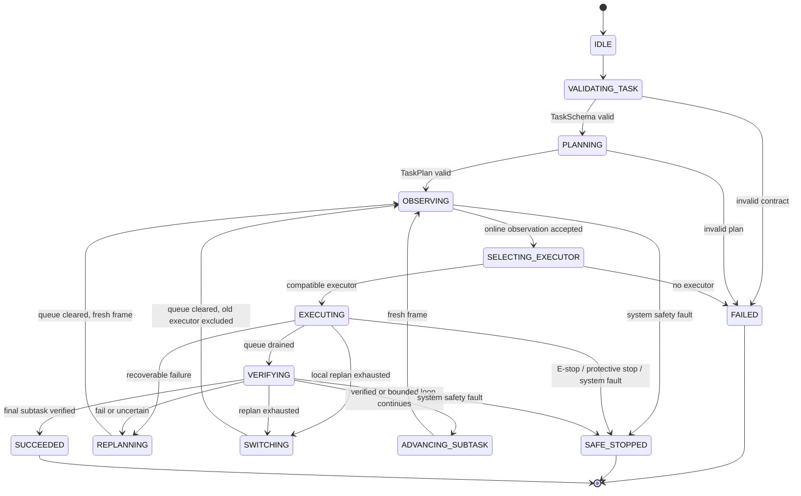
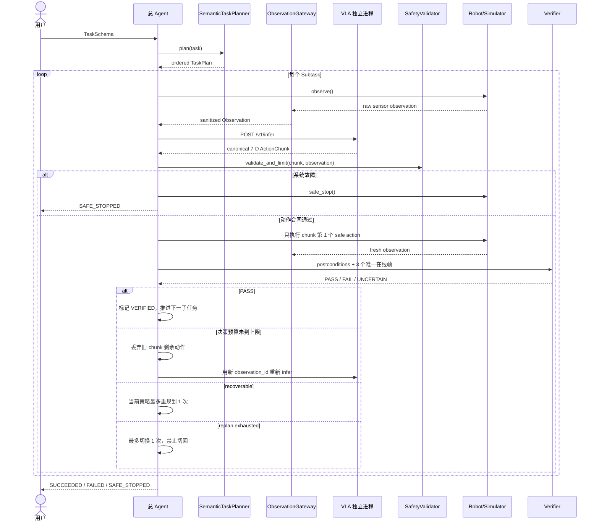

# 工业智能体总 Agent 框架

版本：1.0
状态：轻量参考实现，可运行 Mock；真实模型与真实机器人尚未接入
适用范围：轻量总 Agent + OpenVLA-OFT / π0.5 双 VLA 执行

## 1. 目标与非目标

总 Agent 负责把用户自然语言任务转换为可审计的语义级计划，选择 VLA
执行器，执行安全门控，在每个子任务后重新感知与核验，并按确定性上限进行
恢复。它不生成机器人坐标、轨迹、抓取点或关节控制量。

当前代码的目标：

1. 固化 TaskSchema、TaskPlan、Observation、ActionChunk 和事件契约。
2. 用显式 FSM 表达所有正常、恢复、切换和安全停止路径。
3. 将 OpenVLA-OFT 与 π0.5 视为两个独立进程，允许 D/E 并行开发。
4. 在任何动作进入机器人/仿真控制器前完成 7 维合同校验和安全检查。
5. 用在线传感器后置条件验证结果，不把 GT 暴露给 Agent。
6. 用零第三方依赖 Mock 演示成功、重规划、切换和系统故障安全停止。

当前代码明确不代表：

- 已下载、微调、部署或验证真实 OpenVLA-OFT / π0.5 权重；
- 已完成真实相机、Franka/夹爪或 Isaac Sim 接口；
- 已达到比赛指标；
- 可替代机器人控制器、PLC、安全门或人工急停的功能安全认证。

Isaac Sim 5.1 / Isaac Lab 2.3.2 可作为 B 的计划环境，但不是本核心包的
运行依赖。真实 VLA 版本、CUDA/PyTorch/JAX 依赖必须留在各自独立环境。

## 2. 冻结的职责边界

| 组件 | 责任 | 明确不负责 |
|---|---|---|
| `TaskSchema` | 接收任务、目标、约束、可观测后置条件 | 轨迹和动作 |
| `SemanticTaskPlanner` | 生成有序语义子任务及依赖 | 坐标、姿态、抓取点 |
| `AgentFSM` | 唯一合法状态转移 | 隐式异常跳转 |
| `ExecutorRouter` | 按偏好、能力、健康状态选 VLA | 模型内部推理 |
| `OpenVLAOFTAdapter` | 协议转换、调用独立进程、归一化 action chunk | 导入/加载真实模型 |
| `Pi05Adapter` | 协议转换、调用独立进程、归一化 actions | 导入 JAX/openpi |
| `ObservationGateway` | 在线白名单、版本检查、GT 深度扫描 | 离线评测 GT |
| `ActionSafetyValidator` | 合同、NaN/Inf、限幅、工作空间校验 | 功能安全认证 |
| `ExecutionEnvironment` | observe / step / safe_stop 抽象 | 任务决策 |
| `PostconditionVerifier` | 多帧可观测后置条件投票 | 读取 GT |
| `EventSink` / `RunMemory` | 事件日志和紧凑运行记忆 | 保存隐藏思维链 |

## 3. 代码结构

```text
src/industrial_agent/
├── contracts.py       # Task、TaskPlan、Observation、7D ActionChunk
├── planner.py         # 三类确定性语义分解模板
├── fsm.py             # 显式状态和允许转移
├── observation.py     # 在线白名单与 GT 隔离
├── executor.py        # Protocol、路由、双 VLA 独立进程适配器
├── safety.py          # 动作校验、限幅、工作空间与系统故障
├── verifier.py        # 后置条件与多帧投票
├── environment.py     # 仿真/机器人接口
├── telemetry.py       # JSON 事件与紧凑记忆
├── orchestrator.py    # 总 Agent 编排循环
└── mock.py            # 无第三方依赖 Mock
```

JSON Schema 位于 `schemas/`；默认配置位于
`configs/agent.default.json`；演示入口为
`scripts/run_mock_demo.py`。

## 4. 从指令到 TaskPlan

### 4.1 语义子任务合同

每个 `Subtask` 包含：

| 字段 | 含义 |
|---|---|
| `subtask_id` | 计划内稳定且唯一的 ID |
| `sequence` | 从 1 开始连续递增 |
| `instruction` | 交给 VLA 的自然语言子指令 |
| `task_type` | 能力路由标签 |
| `preconditions` | 开始前必须成立的可观测条件 |
| `postconditions` | 本子任务结束后必须成立的可观测条件 |
| `depends_on` | 只能引用序列中已出现的子任务 |
| `assigned_executor` | 可选执行器偏好，不是强制硬编码 |
| `repeat_until_postcondition` | 是否为有界语义循环 |
| `max_iterations` | 循环动作块上限，1–100 |
| `status` | PENDING / READY / RUNNING / VERIFIED / FAILED |

Schema 中没有 `coordinate`、`pose`、`trajectory`、`waypoint` 或
`grasp_point`。总 Agent 不能越权生成低层运动方案。

### 4.2 内置确定性分解

| workflow | 语义计划 | 循环/推进规则 |
|---|---|---|
| `place_in_designated_slot` | 定位目标 → 放入指定格 | 定位核验通过后才执行放置 |
| `pack_until_full` | 逐件装箱，传感器确认满后停止 | 每轮一个动作块，最多 `max_pack_iterations` |
| `fill_then_move_stack` | 未满先装满 → 搬运满箱 → 叠放 | 满箱后才解锁搬运；搬运后才解锁叠放 |
| `single` | 原任务作为单一子任务 | 用于未模板化的任务 |

扩展新任务时，在 `SemanticTaskPlanner` 增加模板并保持四条约束：

1. 只输出语义意图；
2. 每个子任务有可观测后置条件；
3. 循环必须有硬上限；
4. 依赖只能向前引用，禁止环。

未来若接入 NLP/LLM 分解器，它必须输出同一 `TaskPlan` Schema，并在进入
FSM 前通过同样的确定性校验。LLM 不得直接返回动作。

## 5. 显式 FSM



任何映射表以外的跳转都抛出异常，因此日志和测试可以证明没有隐藏路径。

## 6. 主执行序列



执行采用**单步滚动时域**：服务可以返回多步 ActionChunk，但总 Agent 每次
只执行第 1 步，明确丢弃其余旧动作；动作后以新的 `observation_id` 核验，
未完成时重新调用 VLA。这样第 2 个物理动作永远不会沿用第 1 步之前生成的
旧视觉判断。每个子任务开始前也会重新 `observe()`；已 `VERIFIED` 的子任务
不会因后续子任务失败而重跑。

## 7. 恢复策略与硬不变量

| 触发 | 当前动作队列 | 同策略 | 切换 | 终态 |
|---|---|---|---|---|
| 后置条件 FAIL/UNCERTAIN，滚动决策预算未耗尽 | 丢弃剩余旧动作 | 新帧重新 infer，不计技术重规划 | 不切换 | 继续当前子任务 |
| 后置条件 FAIL/UNCERTAIN，滚动决策预算耗尽 | 清空 | 当前子任务最多重规划 1 次 | 重规划耗尽后最多 1 次 | 耗尽后 FAILED |
| 执行器超时/坏响应 | 清空 | 同上 | 同上 | 耗尽后 FAILED |
| 动作合同/工作空间拒绝 | 清空 | 同上 | 同上 | 耗尽后 FAILED |
| E-stop / protective stop / system fault | 立即清空 | 禁止 | 禁止 | SAFE_STOPPED |

硬不变量：

- 重规划计数以“当前子任务 + 当前策略”为边界；
- 一个运行全程最多发生一次策略切换；
- 被切走的执行器加入**整个 run** 的排除集合；后续子任务也不允许切回；
- 重规划、切换、终止和安全停止都调用 `action_queue.clear()`；
- 系统故障检查发生在初始感知、每个动作后和每个核验帧；
- 安全停止调用环境 `safe_stop()`，不进入核验和恢复；
- 循环装箱属于正常业务循环，不消耗技术重规划次数，但受
  `max_iterations` 硬上限约束。
- repeat-until 子任务在下发动作前先核验；例如料箱已满时零动作完成。

## 8. Observation 白名单与 GT 隔离

在线顶层只允许：

`observation_version`、`observation_id`、`timestamp_ms`、`camera`、
`objects`、`robot`、`safety`、`task`、`quality`。

`ObservationGateway` 会递归扫描所有键，大小写归一化后拒绝：

`gt`、`ground_truth`、`groundtruth`、`label(s)`、`annotation(s)`、
`oracle`、`privileged_state` 及其复合键（如 `sim_gt_mask`、
`ground_truth_pose`），并拒绝 `target_pose`、`grasp_point`、`waypoint`
等越权低层目标几何。

发现 GT 字段时整个在线帧以 `OBS_1102_GT_FORBIDDEN` 拒绝；不会静默删除后
继续决策。离线评测、标注和指标计算必须在 F 的独立进程/目录完成，禁止把
GT 合并进在线 Observation。`robot` 和 `safety` 是必需字段，三项安全状态
缺失或类型错误均 fail-closed。每个 run 内 `observation_id` 必须唯一，时间戳
不得倒退。`mock.py` 的完成规则是仿真内部状态，Agent 只看到模拟传感器结果。

## 9. 统一 7 维物理动作合同

动作向量固定为：

```text
[dx_m, dy_m, dz_m, droll_rad, dpitch_rad, dyaw_rad, gripper_norm]
```

| 维度 | 坐标系/单位 | 默认单步绝对上限 |
|---|---|---:|
| dx, dy, dz | `robot_base` / m | 0.05 |
| droll, dpitch, dyaw | 增量欧拉角 / rad | 0.25 |
| gripper | 归一化命令 | 1.0 |

固定元数据：

- `action_space = ee_delta_pose_gripper`
- `frame = robot_base`
- `translation_unit = m`
- `rotation_unit = rad`
- `gripper_unit = normalized`
- `contract_version = 1.x`

执行前顺序：

1. 校验合同主版本、字段、动作空间、坐标系、单位和非空 chunk；
2. 校验每一步恰好 7 维；
3. NaN/Inf 直接拒绝，不做限幅；
4. 各轴超限值确定性夹紧并记录 `safety.action_limited`；
5. 逐步累积前三维，预测 TCP 是否越出工作空间；
6. 超出工作空间时拒绝整个 chunk，任何一步都不下发；
7. 通过后只把第 1 步进入内存动作队列；剩余动作在新观测前不得执行。

默认工作空间为 x/y `[-1.0, 1.0] m`、z `[0.0, 1.5] m`。这些只是 Mock
缺省值，真实部署必须由 B 根据场景、机器人和安全评估冻结。

## 10. 后置条件与多帧投票

支持四种在线条件：

| kind | 必要字段 | 语义 |
|---|---|---|
| `field_equals` | `path`, `expected` | 传感器字段等于期望 |
| `numeric_range` | `path`, minimum/maximum | 数值在区间内 |
| `object_detected` | `object_id` | 目标被高置信检测 |
| `object_in_zone` | `object_id`, `zone_id` | 目标在语义区域内 |

每帧先检查 `quality.confidence >= min_confidence`。字段缺失、类型错误或低
置信度计为 `UNCERTAIN`，不是成功。默认收集 3 帧、每个条件需要 2 票：

- PASS 票达到 `required_votes`：该条件 PASS；
- FAIL 票达到 `required_votes`：该条件 FAIL；
- 其余：UNCERTAIN；
- 所有条件 PASS 才能推进子任务。
- 帧 ID 必须互不相同且时间不得倒退；重复同一帧不能重复投票。

Verifier 不接收 GT。若 F 将 Verifier 独立部署，使用
`POST /v1/verify` 契约，语义必须保持一致。

## 11. 路由和真实模型接入

路由优先级：

1. `Subtask.assigned_executor`；
2. 父任务 `preferred_executor`；
3. 注册顺序中第一个同时满足 task type、健康、未被排除的执行器。

OpenVLA-OFT 服务由 D 维护，模型输入包含 `full_image`、可选
`wrist_image`、`state`、`task_description`，服务将连续动作 chunk
归一化成统一合同。

π0.5/openpi 服务由 E 维护，内部可使用 `policy.infer(...)["actions"]`、
policy server、LeRobot 与独立 norm stats，服务边界同样只返回统一合同。

两个服务必须分别固定：

- 独立运行环境和锁文件；
- `checkpoint_sha`；
- `norm_stats_sha`；
- 服务镜像 digest；
- 本服务支持的 action contract 主版本。

总 Agent 不导入两边框架，也不假设两边归一化统计相同。详细 HTTP/WebSocket
约定见 `interface-contracts.md`。

## 12. 结构化事件与记忆

每条事件包含 `schema_version`、`event_id`、run 内单调 `sequence`、
`timestamp_ms`、`run_id`、`task_id`、`event_type`、FSM `state` 和
`payload`。

关键事件：

- `run.started/succeeded/failed/safe_stopped`
- `task_plan.created`
- `fsm.transition`
- `executor.selected`
- `action_chunk.accepted`
- `safety.action_limited`
- `verification.completed`
- `subtask.iteration_incomplete/subtask.verified`
- `recovery.replan/recovery.switch`
- `action_queue.cleared`
- `closed_loop.redecision`

`RunMemory` 只保存恢复需要的确定性事实：当前计划/子任务/执行器、执行器
历史、重规划和切换计数、最后错误码、最后 observation ID、完成的 chunk
ID。它不保存模型隐藏推理或未经筛选的图像。

## 13. 配置与启动

核心依赖仅 Python 3.10+ 标准库。运行 Mock：

```powershell
python -m pip install -e ".[test]"
python scripts/run_mock_demo.py
```

运行单元测试：

```powershell
python -m unittest discover -s tests -v
```

`configs/agent.default.json` 的部署 URL 通过
`build_executors_from_config(config, transport_factory)` 绑定到独立进程 transport；
随后由 `IndustrialAgent.from_config(executors, config)` 加载核心参数并精确比对
执行器名称、动作合同、checkpoint SHA 与 norm stats SHA。其机器约束见
`schemas/agent-config.schema.json`。代码会拒绝未固定摘要、执行器身份漂移、打开
回切、增加切换次数或关闭恢复清队列等破坏冻结不变量的配置。

Mock 的预期结果：

| scenario | 预期 |
|---|---|
| success | OpenVLA 一次成功 |
| recovery | OpenVLA 失败后只重规划一次并成功 |
| switch | OpenVLA 重规划仍失败，切 π0.5 成功，不切回 |
| system_fault（测试） | 动作后立即 SAFE_STOPPED，不进入 VERIFYING |

## 14. 集成 Definition of Done

真实系统合并前至少满足：

- D/E 服务 `/health` 返回实际加载的 checkpoint/norm SHA；
- 固定请求在固定权重与 seed 下可复现；
- 返回动作全部通过 `action-chunk.schema.json`；
- B 的环境适配器对 `safe_stop` 和控制器缓冲清空有集成测试；
- C 的场景只通过在线白名单提供数据；
- F 能证明评测 GT 没有进入 Agent 进程；
- 成功、同策略恢复、策略切换、故障停止各保存一条完整事件链；
- 使用真实工作空间、速度/增量上限替换 Mock 默认值；
- 接口契约测试、回放测试和至少一次端到端演练通过。
