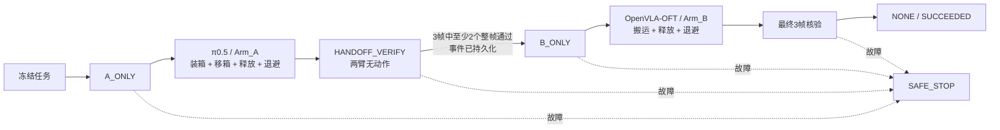

# 历史 V1 四 Agent 框架（已废除）

产品基线：v2.0
冻结日期：2026-07-26

> 本文只保留历史设计记录，不具有执行权威。正式框架是 V2
> `v2_supervisor.py` + π0.5/Arm_A；生产入口明确拒绝 V1 配置。
>
> 2026-08-18 旧场景口径：本文主体描述 V1 自动闭环。
> 当前场景开发与数据采集以 `single_bin_manual_industrial_v2` 为准：8 个工件、
> A/B/C/D 各 2 件、2×4 料箱，并通过键盘人工生成 Canonical Episode。V2 暂未
> 宣称已打通本文所述双 VLA 自动搬运闭环。

## 1. 一句话结论

系统采用固定四 Agent、双 VLA、双 Franka、单料箱、静态中央交接位：

> π0.5 理解预设自然语言并控制 Arm_A 完成装箱和交接；Supervisor 用确定性
> FSM、安全规则和多帧证据管理生命周期；OpenVLA-OFT 控制 Arm_B 搬运同一料箱；
> YOLO 同帧保存检测框，供离线 mAP 评分。

不增加 NLP Agent，不做“简单任务/复杂任务”路由，不让两个 VLA 互相接管。

## 2. 中文架构图


[简化可编辑 SVG](assets/four-agent-single-bin-static-handoff-framework-v3.svg)

图中实线是控制闭环，虚线是 YOLO 评分证据链。YOLO 失败不会改变 VLA
执行顺序或控制令牌。

> 上图对应 V1 自动闭环。当前 V2 场景布局见
> [V2 人工工业采集说明](../v2-manual-industrial-collection.md)。

## 3. 冻结决策

| 项目 | 冻结结果 |
|---|---|
| Agent 数量 | 4：Supervisor、π0.5、OpenVLA-OFT、YOLO |
| 机械臂 | 2 台 Franka：Arm_A、Arm_B |
| 料箱 | 1 个 `Bin_01` |
| 传送带 | 无 |
| 共享位置 | 固定中央交接位 `HANDOFF_CENTER` |
| π0.5 | Arm_A 唯一 VLA，负责装四个零件、移箱、释放、退避 |
| OpenVLA-OFT | Arm_B 唯一 VLA，负责搬同一料箱到 `FINISHED_01`、释放、退避 |
| Supervisor | 固定任务模板、FSM、令牌、安全、核验、恢复、遥测；不做 NLP |
| YOLO | 独立目标检测与 mAP 证据；不产生机械臂动作 |
| 在线 GT | 严禁进入任何 Agent |
| 失败恢复 | 当前阶段同一 VLA 有界恢复；硬超时隔离并停机 |

## 4. 四个 Agent 的职责

| Agent | 输入 | 输出 | 明确禁止 |
|---|---|---|---|
| Supervisor | 冻结 TaskSchema、在线 Observation、服务健康状态 | TaskPlan、FSM 状态、控制令牌、事件、最终结果 | 理解自然语言、按复杂度选模型、生成 VLA 动作、读取 GT |
| π0.5 | Arm_A 冻结原始指令、`CAM_A_TOP`、Arm_A 状态 | Arm_A canonical ActionChunk | 控制 Arm_B、改写任务、读取 YOLO/GT 后作弊 |
| OpenVLA-OFT | Arm_B 冻结协作指令、`CAM_B_TOP`、Arm_B 状态 | Arm_B canonical ActionChunk | 控制 Arm_A、选择上游零件、读取 GT |
| YOLO | 当前阶段单张不可变 RGB、类别白名单、阈值 | bbox、类别、置信度、时延、模型/帧摘要 | 理解任务、生成动作、授予令牌、调用 VLA、读取在线 GT |

Safety、Verifier、Isaac Sim Adapter、离线 mAP Evaluator 是普通确定性组件，
不是第五、第六个 Agent。

## 5. V1 自动闭环场景与分区

本节的四工件、2×3 料箱和自动交接均属于 V1 兼容基线；当前 V2 改为 A/B/C/D
各 2 件、共 8 件和 2×4 料箱，详细参数以 V2 场景配置与合同为准。

场景采用一张工作台：

- 左侧蓝区：Arm_A 装箱工作区；
- 中间绿区：`HANDOFF_CENTER`，单料箱静态交接；
- 右侧橙区：Arm_B 搬运工作区和 `FINISHED_01`；
- 左区四个托盘：前三个共放四个零件，第四个为空；
- `Bin_01` 放在蓝区靠中央桌角，Arm_A 能抓取并放到绿区；
- 两臂只在各自阶段运动，共享区永远只有一枚控制令牌。

场景详情与坐标：

- [单料箱静态交接场景](single-bin-static-handoff-scene-v2.md)
- [端到端场景流程](final-frozen-scene-and-flow.md)
- [Isaac Sim 构建脚本](../../simulation/build_single_bin_scene.py)

## 6. 固定生命周期



令牌顺序只能是：

```text
A_ONLY -> HANDOFF_VERIFY -> B_ONLY -> NONE
```

| 阶段 | 可运动机械臂 | 进入条件 | 离开条件 |
|---|---|---|---|
| `A_ONLY` | 仅 Arm_A | 任务、双 VLA、相机和安全预检通过 | 料箱已交接、Arm_A 释放并退避 |
| `HANDOFF_VERIFY` | 无 | `A_ONLY` 下候选预检通过，旧动作已清空且双臂锁定 | 锁臂后新采三帧取得两票，`handoff.verified` 与 `handoff.ready` 依次持久化 |
| `B_ONLY` | 仅 Arm_B | durable `handoff.ready` 已确认 | 同一料箱到完成区、Arm_B 释放并退避 |
| `NONE` | 无 | 最终核验成功或安全停止 | 新 episode reset |

交接事件类型采用唯一的点号命名：

| `event_type` | 语义 | 能否授权 Arm_B |
|---|---|---|
| `handoff.candidate_checked` | `A_ONLY` 下的单帧候选预检结果 | 否 |
| `handoff.verified` | 双臂锁定后，三张新鲜帧的 2/3 复合投票证据已持久化 | 否 |
| `handoff.ready` | 核验证据 durable 后发布的就绪事件 | 是，durable ACK 后才可授予 `B_ONLY` |

冻结自然语言中的 `handoff_ready` 只是业务信号名称，不得用作
`event_type`；事件类型禁止下划线拼写。

## 7. 单步闭环

两个 VLA 都执行相同的滚动时域闭环：

```text
获取新 Observation
-> 当前阶段 YOLO 同帧留证（失败不门控）
-> 调用当前阶段固定 VLA
-> 推理完成后再次观测
-> Safety + 令牌 + 工作空间 + 对侧臂互锁
-> 控制器原子 compare-and-execute
-> 只执行 ActionChunk 第 1 步
-> 获取新 Observation
-> 核验
-> 成功 / 同角色有界重规划 / 安全停止
```

即使 VLA 返回多步，在线基线也只执行第一步，剩余旧动作全部丢弃。
这样每次环境变化都会触发重新观察和重新决策，形成可展示的真实闭环。

## 8. 为什么自然语言仍由 VLA 处理

比赛允许我们预设自然语言，因此 Supervisor 无需先“理解”句子再决定用哪个模型：

1. 部署配置已经固定第一阶段一定由 π0.5/Arm_A 执行；
2. Supervisor 原样传递 Arm_A 预设指令；
3. π0.5 用视觉和语言识别 P01–P04、判断倒放姿态并生成装箱、交接动作；
4. Arm_A 完成后，Supervisor 根据传感事实而不是 NLP 切换生命周期；
5. Arm_B 使用另一条冻结协作指令，由 OpenVLA-OFT 执行。

因此“VLA 负责语言理解”与“Supervisor 管理生命周期”并不冲突。

## 9. YOLO 与 VLA 的关系

VLA 的视觉编码器用于视觉—语言—动作推理；YOLO 用于输出可量化检测框。
二者读取同一阶段、同一图像 SHA，但职责不同：

| 模块 | 主要目的 | 是否控制机械臂 |
|---|---|---|
| VLA | 根据图像和语言生成动作 | 是 |
| YOLO | 输出 bbox、类别、置信度，形成 mAP 证据 | 否 |

YOLO 必须保存：

```text
trace_id + observation_id + camera_id + image_sha256
checkpoint_sha + class_map_sha + config_sha
bbox + class + confidence + latency
```

零检测、超时和坏包也要保存，不能只挑“好看的框”。离线使用冻结 GT
计算 AP50、AP75、mAP50:95、Precision、Recall 和 P50/P95 时延。

## 10. 交接核验

Arm_A 释放并退避后，Supervisor 先在 `A_ONLY` 下用当前新鲜 observation 做一次
候选预检并记录 `handoff.candidate_checked`。候选通过只允许进入锁臂阶段，不算
最终票，也不表示 ready。随后清空动作队列、撤销 A 的运动权限并进入
`HANDOFF_VERIFY`，再采集**恰好三个**不同的新 observation。最终投票只使用这
三张锁臂后帧：

```text
一帧通过 = 该帧所有必需条件同时成立
最终通过 = 三帧中至少两帧通过
```

不得从不同帧拼条件。
候选帧和锁臂前的任何帧都会被丢弃，因此不存在“1 + 3 + 3 共 7 帧参与投票”的
路径。

Arm_A 交接条件：

- `packed_part_count == 4`；
- `Bin_01` 在 `HANDOFF_CENTER`，不在 `FINISHED_01`；
- 料箱速度 `<= 0.02 m/s`；
- Arm_A 夹爪已打开且已退避；
- Arm_B 已退避；
- 两臂静止；
- 无急停、保护停和系统故障；
- 质量字段有效。

通过后先 fsync 持久化 `handoff.verified`，再 fsync 持久化
`handoff.ready`；只有后者收到 durable ACK 后才授予 `B_ONLY`。

最终完成条件：

- 同一 `Bin_01` 在 `FINISHED_01`，不在 `HANDOFF_CENTER`；
- 料箱速度 `<= 0.02 m/s`；
- Arm_B 夹爪已打开且已退避；
- Arm_A 已退避；
- 两臂静止。

## 11. 安全与执行一致性

每个动作必须同时通过：

1. canonical ActionChunk 契约；
2. 7 维有限数和轴限幅；
3. VLA、机械臂和控制令牌绑定；
4. 该机械臂自己的 `robot_base` 工作空间；
5. 对侧机械臂退避互锁；
6. 推理后新观测的状态再检查；
7. 控制器端 `observation_id + state_digest + command_id` 原子再校验。

同一个 `chunk_id` 或 `command_id` 不得重复执行。

完整接口见 [接口契约](interface-contracts.md)。

## 12. 有界恢复与安全停止

| 故障 | 处理 |
|---|---|
| 普通 VLA 可恢复错误 | 清队列、刷新观测、当前同一 VLA 最多重规划一次 |
| VLA 硬超时 | 隔离该 executor，不重入，清队列并 safe-stop |
| 物体区域在推理期间变化 | 丢弃旧 chunk，同一 VLA 用新观测重规划 |
| 对侧臂/安全/令牌在推理期间变化 | 立即 safe-stop |
| YOLO 空检测/超时/坏包 | 留失败证据；VLA 控制链继续 |
| step 超时 | 动作结果未知；走独立 safe-stop |
| 相机、急停、保护停、控制器故障 | 不发新动作，立即 safe-stop |
| 停机回执或停后传感确认失败 | `SAFE_STOP_FAILED` |

只有控制器 `SafeStopReceipt` 和停后传感器都确认两臂静止，才能进入
`SAFE_STOPPED`。软件令牌切为 `NONE` 只代表撤销命令权限，不等于物理停止证明。

任何恢复都禁止：

- 把 Arm_A 任务交给 OpenVLA-OFT；
- 把 Arm_B 任务交给 π0.5；
- 复用旧 ActionChunk；
- 两臂同时进入交接区；
- 用 GT 帮助在线控制；
- 用 YOLO 结果直接改写 VLA 动作。

## 13. 服务与 Docker

建议服务：

| 服务 | 端口 | 容器职责 |
|---|---:|---|
| Supervisor | 8000 | FSM、安全、核验、遥测 |
| π0.5 | 8101 | Arm_A VLA 推理 |
| OpenVLA-OFT | 8102 | Arm_B VLA 推理 |
| YOLO | 8103 | 检测和证据 |
| Isaac Adapter | 8200 | 仿真循环、控制器 ACK、独立急停 |

Isaac Adapter 额外负责把三台相机的新鲜 RGB 原子写入共享图像 CAS。最终 Docker
使用同一个 `image-cas` volume：Isaac Adapter 读写挂载，π0.5、OpenVLA-OFT、
YOLO 只读挂载；Supervisor 不挂载、不解码图像。CAS 根目录统一通过
`INDUSTRIAL_AGENT_CAS_ROOT` 注入。完整规则见
[`ADR-0004-shared-image-cas.md`](ADR-0004-shared-image-cas.md)。

冻结场景只有 `CAM_A_TOP`、`CAM_HANDOFF`、`CAM_B_TOP` 三台物理 RGB 相机；
没有腕部相机 Prim。统一 VLA 请求中的 `wrist_image` 在本版本必须为 JSON
`null`，不得用任一顶视相机回填。

启动顺序：

1. 共享 CAS 卷、Isaac Sim 场景、物理、双臂和三相机；
2. 受控仿真循环与独立急停通道；
3. YOLO；
4. π0.5；
5. OpenVLA-OFT；
6. Supervisor 做 health、版本、SHA 和契约预检；
7. reset 到 `A_ONLY`；
8. 提交冻结任务。

退出时必须先撤销控制权并确认双臂安全停止，再结束模型与仿真服务。
SIGINT、SIGTERM、异常和容器关闭都不得绕过急停；外部 watchdog 是生产必需项。

## 14. 最小验收

- [ ] 一个 episode 中 π0.5 先执行，OpenVLA-OFT 后执行；
- [ ] π0.5 只控制 Arm_A，OpenVLA-OFT 只控制 Arm_B；
- [ ] Arm_A 装入 P01–P04，并将 `Bin_01` 放到中央交接位；
- [ ] 三个不同帧至少两个整帧 PASS 后才出现 `B_ONLY`；
- [ ] `handoff.verified` 在令牌切换前已 durable；
- [ ] `handoff.ready` 在授予 `B_ONLY` 前已 durable，且不存在下划线事件类型；
- [ ] Arm_B 搬运同一个 `Bin_01` 到 `FINISHED_01`；
- [ ] 每个物理动作后都有新 observation 和新 VLA 决策；
- [ ] 两臂从未同时拥有共享区控制权；
- [ ] YOLO 保存检测框、空预测、失败、时延和全部摘要；
- [ ] 冻结 GT 只出现在离线 mAP 评测器；
- [ ] 成功、普通恢复、VLA 超时、step 超时、急停成功和急停确认失败均可回放；
- [ ] Docker 中所有服务使用固定版本和可追溯权重。
