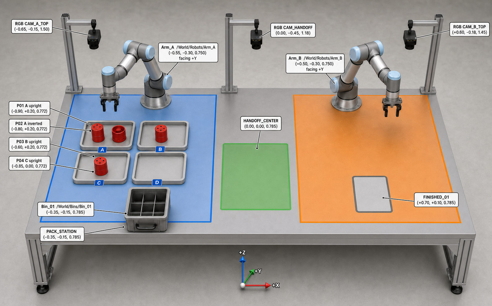

# 最终冻结场景与双 VLA 串行闭环

> 状态：最终冻结
>
> 日期：2026-07-26
>
> 适用范围：Isaac Sim MVP、Docker 演示、技术报告和答辩视频

## 1. 场景边界



场景名称：**双臂单料箱装箱—静态交接—成品搬运工作站**。

- 两台 Franka 固定在同一工作台，当前都使用二指夹爪；
- Arm_A 负责左侧装箱区，Arm_B 负责右侧成品区；
- 一个 2×3 料箱从 `PACK_STATION` 出发；
- 四个红色零件按 A/B/C/D 区数量 `2/1/1/0` 放置，其中 P02 倒放；
- Arm_A 装完四件后把料箱直接放到固定 `HANDOFF_CENTER`；
- 没有传送带、移动交接台、第二个料箱或叠箱动作；
- Arm_A 退出后，Supervisor 完成三帧核验，再允许 Arm_B 抓取；
- Arm_B 把同一料箱搬到唯一成品位 `FINISHED_01`。

## 2. 世界坐标与节点

坐标单位为米，`+X` 从 Arm_A 指向 Arm_B，`+Y` 指向工作台后侧，`+Z`
竖直向上。配置真源是
[`../../simulation/configs/single_bin_scene_v1.json`](../../simulation/configs/single_bin_scene_v1.json)。

| 对象 | Isaac Sim Prim | 初始位置 `(x,y,z)` |
|---|---|---:|
| Arm_A / π0.5 | `/World/Robots/Arm_A` | `(-0.55,-0.30,0.750)` |
| Arm_B / OpenVLA | `/World/Robots/Arm_B` | `(+0.50,-0.30,0.750)` |
| 空料箱 | `/World/Bins/Bin_01` | `(-0.35,-0.15,0.785)` |
| P01 正放 | `/World/Parts/P01` | `(-0.90,+0.20,0.772)` |
| P02 倒放 | `/World/Parts/P02` | `(-0.80,+0.20,0.772)` |
| P03 正放 | `/World/Parts/P03` | `(-0.60,+0.20,0.772)` |
| P04 正放 | `/World/Parts/P04` | `(-0.85,0.00,0.772)` |
| 静态交接位 | `/World/Stations/HANDOFF_CENTER` | `(0.00,0.00,0.785)` |
| 唯一成品位 | `/World/Stations/FINISHED_01` | `(+0.70,+0.10,0.785)` |

关键平面距离均不超过 MVP 软限制 `0.65 m`；这只是几何预检，最终还必须在
Isaac Sim 中验证预抓取、抓取、抬升、放置 IK、碰撞和关节余量。

## 3. RGB 相机

| 相机 | Prim | 建议位置 | 主要用途 |
|---|---|---:|---|
| A 区顶视 RGB | `/World/Cameras/CAM_A_TOP` | `(-0.65,-0.15,1.50)` | P01–P04、格口、Arm_A 装箱 |
| 交接 RGB | `/World/Cameras/CAM_HANDOFF` | `(0.00,-0.45,1.18)` | 箱体进入 ROI、稳定、夹爪释放 |
| B 区顶视 RGB | `/World/Cameras/CAM_B_TOP` | `(+0.60,-0.18,1.45)` | Arm_B 抓箱、成品位放置 |

VLA 接收未叠加检测框的完整 RGB 图像。YOLO 使用同一原始帧的不可变副本，
以 `observation_id + image_sha256` 与动作和事件关联。

## 4. 固定角色指令

以下两条是 `single_bin_pack_handoff_v1` 的唯一逐字冻结值，不是任务语义示例。
机器可执行真源与版本变更规则见
[`interface-contracts.md`](interface-contracts.md#1-冻结边界)。

### π0.5 / Arm_A

```text
将工作区中的四个红色零件依次装入料箱；倒放零件先调整为正向。装箱完成后，将料箱放到中央交接位并返回 HOME_A。失败时重新观察后继续。
```

### OpenVLA-OFT / Arm_B

```text
收到 handoff_ready 后，观察中央交接位，抓稳 Bin_01 并保持水平，将其搬到 FINISHED_01，松开夹爪并返回 HOME_B。
```

两条自然语言均在任务配置中预设。Supervisor 只原样传输，不识别关键词、
不判断任务难度、不生成新子指令。

## 5. 完整闭环例子

| 步骤 | FSM 状态 | 令牌 | 执行者 | 动作与证据 | 通过条件 |
|---:|---|---|---|---|---|
| 1 | `IDLE → RESET` | `NONE` | Supervisor、Isaac | 双臂归零、清动作队列、确认交接位为空 | `HOME_A && HOME_B` |
| 2 | `RESET → OBSERVE_A` | `A_ONLY` | Supervisor、相机 | 获取 A 区新鲜 RGB；同步调用 YOLO 保存 P01–P04 bbox，失败只留证 | 图像与机器人状态有效 |
| 3 | `OBSERVE_A → INFER_A` | `A_ONLY` | π0.5 | 接收原始 A 指令、A 区全图和 Arm_A 状态 | 返回 Arm_A ActionChunk |
| 4 | `INFER_A → EXECUTE_A` | `A_ONLY` | Safety、Arm_A | 只执行首个安全动作，靠近 P01 | 无越界、无碰撞 |
| 5 | `EXECUTE_A → VERIFY_A` | `A_ONLY` | Supervisor、相机 | 清空旧动作，重新观察；YOLO 留存新帧预测 | 抓取/放置证据有效 |
| 6 | `VERIFY_A ↔ INFER_A` | `A_ONLY` | π0.5、Arm_A | 以新观测继续抓 P01 并放入格口；对 P02 先纠姿，再处理 P03/P04 | 四件均在箱内且无掉落 |
| 7 | `VERIFY_A → PACK_COMPLETE` | `A_ONLY` | Supervisor | 核对四个零件、料箱身份和 Arm_B 仍在 HOME_B | `pack_complete` |
| 8 | `PACK_COMPLETE → ARM_A_HANDOFF` | `A_ONLY` | π0.5、Arm_A | 重新观察后抓料箱，将其放到固定中央 ROI | 箱体已释放 |
| 9 | `ARM_A_HANDOFF → ARM_A_RETREAT` | `A_ONLY` | Arm_A | Arm_A 返回 `HOME_A`，清空控制队列 | Arm_A 离开共享区 |
| 10 | `ARM_A_RETREAT → HANDOFF_VERIFY` | `HANDOFF_VERIFY` | Supervisor | 撤销 A 令牌；两臂均禁止进入共享区 | 队列清空、双臂安全 |
| 11 | `HANDOFF_VERIFY` | `HANDOFF_VERIFY` | Supervisor、相机、Verifier | 连续采集 3 张不同帧；核对箱体在 ROI、速度低、A 已释放并退回 | 至少 2 帧 PASS |
| 12 | `HANDOFF_VERIFY → HANDOFF_READY` | `B_ONLY` | Supervisor | 先持久化 `handoff_ready`，再授予 B 令牌 | 事件与令牌写入日志 |
| 13 | `HANDOFF_READY → OBSERVE_B` | `B_ONLY` | 相机、YOLO | 获取 B/交接区新鲜 RGB；同步调用 YOLO 保存满箱 bbox，失败只留证 | 图像与 Arm_B 状态有效 |
| 14 | `OBSERVE_B → INFER_B` | `B_ONLY` | OpenVLA-OFT | 接收固定 B 指令、完整图像与 Arm_B 状态 | 返回 Arm_B ActionChunk |
| 15 | `INFER_B ↔ EXECUTE_B` | `B_ONLY` | Safety、Arm_B | 单步滚动抓稳料箱、抬升、保持水平、移动到成品位 | 每步后均有新观测 |
| 16 | `EXECUTE_B → FINISHED_VERIFY` | `B_ONLY` | Supervisor、相机 | 确认同一料箱进入 `FINISHED_01`、已释放、零件无掉落 | 后置条件通过 |
| 17 | `FINISHED_VERIFY → TASK_SUCCEEDED` | `NONE` | Arm_B、Supervisor | Arm_B 返回 `HOME_B`，撤销 B 令牌 | 双臂安全、成品到位 |
| 18 | `TASK_SUCCEEDED → IDLE` | `NONE` | Supervisor、离线评测 | 保存 Trace、动作、事件、三路原始预测和视频；离线计算 mAP | 结果包完整 |

## 6. 当前阶段恢复

```text
动作失败
→ 立即清空当前机械臂的旧动作
→ 获取该工作区的新 Observation
→ 再次调用当前阶段的固定 VLA
├─ 预算内恢复：继续
└─ 预算耗尽：SAFE_STOPPED
```

- Arm_A 阶段只调用 π0.5；
- Arm_B 阶段只调用 OpenVLA-OFT；
- 交接核验失败时两臂都不动；
- 相机、控制器、急停或保护停故障直接安全停止；
- YOLO 旁路失败必须留证，但不会改变两个 VLA 的固定角色。

## 7. 成功判定

只有以下条件全部成立，任务才是成功：

1. P01–P04 均进入同一 `Bin_01`，P02 已正向，箱外无掉落；
2. Arm_A 把 `Bin_01` 放到固定 `HANDOFF_CENTER` 并返回 `HOME_A`；
3. 三张不同帧中至少两票确认交接条件；
4. 令牌顺序严格为 `A_ONLY → HANDOFF_VERIFY → B_ONLY → NONE`；
5. Arm_B 搬运的是同一 `Bin_01`，最终位于 `FINISHED_01`；
6. Arm_B 返回 `HOME_B`，两臂从未同时进入共享区；
7. 每个物理动作后都有新 observation 和重新推理/核验；
8. `detections.jsonl`、`events.jsonl`、`trace.json`、视频和离线
   `metrics.json` 均可关联且可复算。
