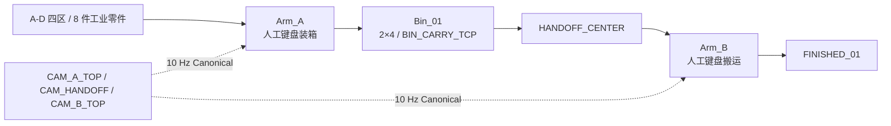

# 当前 V2 工业场景与正式连续闭环

> 更新日期：2026-08-26
>
> 当前场景：`single_bin_manual_industrial_v2`
>
> 正式 Supervisor：`single_bin_manual_industrial_v2` / π0.5 / Arm_A

V2 已完全替换 V1，正式运行只有一条链路：

1. **V2 Canonical 数据链路**生成 π0.5 微调数据；
2. **V2 Supervisor 闭环**执行 `task_id → /v1/infer → 7D → Isaac → 新观测`。

V1 四 Agent/双 VLA/交接生命周期已经废除。相关代码、文档和
`configs/agent.v1.legacy.json` 只用于历史回归，不具有部署权威性。

## 1. 当前 V2 工业场景

V2 使用两台 Franka、三台固定 RGB 相机、A/B/C/D 四个零件区和一个带中央提梁的
`2×4` 料箱。8 个程序化工业零件包括：

- P01/P02：正立轴件；
- P03/P04：倒立轴件；
- N01/N02：带可见通孔的六角螺母；
- W01/W02：带平行手柄与开口端的扳手。



场景坐标、零件几何、槽位和质量预算见
[V2 场景定义](single-bin-static-handoff-scene-v2.md)。

## 2. V2 固定配方

| 槽位 | 零件 | 槽位 | 零件 |
|---|---|---|---|
| S11 | P01（轴件） | S21 | P02（轴件） |
| S12 | P03 | S22 | P04 |
| S13 | N01（螺母） | S23 | N02（螺母） |
| S14 | W01 | S24 | W02 |

V2 空箱质量 `0.5 kg`，零件总质量 `0.5 kg`，计划满载质量 `1.0 kg`。中央提梁
提供 `BIN_CARRY_TCP`；Arm_B 的抓箱目标应使用该帧，不应把箱体几何中心当作抓取点。

## 3. V2 人工采集流程

```text
静态合同 PASS
→ 可见 GUI 构建并保存 USD
→ 保存 CAM_A_TOP / CAM_HANDOFF / CAM_B_TOP 和总览图
→ 两臂 HOME
→ IK 与共享区碰撞检查
→ 双臂微动作 Gate
→ 分别练习轴件、倒立纠正、螺母、扳手
→ 空箱/满箱/20 次满载搬运
→ 正式 Canonical Episode 采集
→ 回放、终局、Split、GT 隔离与哈希 QA
```

V2 当前使用人工键盘动作和 Pink/Lula IK 后端。有效采样频率 `10 Hz`；物理、控制、
渲染频率分别为 `120/60/30 Hz`。练习数据默认不可训练，训练/验证 Split 只允许
完整成功且通过预检与回放的数据。

## 4. V2 当前验收状态

| 层级 | 当前状态 | 说明 |
|---|---|---|
| Python 单元/合同测试 | 已通过 | 不包含 Isaac Sim 真实物理 |
| V2 静态场景合同 | 已通过 | 数量、坐标、槽位、质量、相机与 GT 隔离 |
| 可见 GUI 四图证据 | 待执行 | 必须保存三相机图和总览图 |
| 两臂 HOME/IK/碰撞 | 待执行 | 静态 PASS 不能替代 |
| 抓取与满载搬运 | 待执行 | 包括 20 次满载搬运 |
| 正式可训练 Episode | 待数据 QA | 练习数据不能直接放行 |

因此文档和报告可以写“V2 场景源码与静态合同已通过”，不能写“V2 场景已经完成
Isaac Sim 正式验收”或“八件自动闭环已经打通”。

## 5. V1 历史实现（已废除）

以下内容只解释旧证据，不能作为当前执行合同：

- π0.5 只控制 Arm_A，处理 P01-P04 并把料箱放到 `HANDOFF_CENTER`；
- Supervisor 在锁臂后采集恰好 3 帧，至少 2 帧整帧复合通过；
- `handoff.verified` durable 后发布 `handoff.ready`；
- OpenVLA-OFT 只控制 Arm_B，将同一料箱搬到 `FINISHED_01`；
- YOLO 对同帧保存评分证据，但不控制令牌；
- 失败只能由当前角色基于新鲜观测有界恢复，禁止跨角色接管。

旧四零件、`2×3` 料箱和冻结指令只保存在 `configs/agent.v1.legacy.json`。生产
`build_supervisor()` 明确拒绝 1.x 配置。

## 6. V1 历史冻结指令（不可用于正式请求）

### π0.5 / Arm_A

```text
将工作区中的四个红色零件依次装入料箱；倒放零件先调整为正向。装箱完成后，将料箱放到中央交接位并返回 HOME_A。失败时重新观察后继续。
```

### OpenVLA-OFT / Arm_B

```text
收到 handoff_ready 后，观察中央交接位，抓稳 Bin_01 并保持水平，将其搬到 FINISHED_01，松开夹爪并返回 HOME_B。
```

自然语言中的 `handoff_ready` 是业务信号名称；事件类型必须使用点号形式
`handoff.ready`。

## 7. V1 历史生命周期与交接证据


| 令牌 | 可运动对象 | 放行条件 |
|---|---|---|
| `A_ONLY` | 仅 Arm_A | 任务、观测、服务和安全预检通过 |
| `HANDOFF_VERIFY` | 无 | A 已释放并退避；旧动作清空；双臂锁定 |
| `B_ONLY` | 仅 Arm_B | durable `handoff.ready` 已确认 |
| `NONE` | 无 | 成功终局或安全停止 |

每次 VLA 决策只执行 ActionChunk 的第一个有效动作，然后重新观察、重新校验。
任意相机、控制器、急停、保护停或动作合同故障均进入 safe-stop。

## 8. 两条链路的共享不变量

- `Arm_A → pi05`，`Arm_B → openvla_oft`，禁止互换角色；
- 共享区始终只有一个运动令牌；
- 三台物理 RGB 相机 ID 固定，没有腕部相机；
- `wrist_image` 为 JSON `null`，不能用顶视相机伪造；
- 动作为 7D canonical contract，有限值、单位、frame 与限幅必须校验；
- 图像通过共享 CAS 按 SHA-256 引用；
- 在线 Observation、VLA、YOLO、Supervisor 和 Verifier 都不能读取 GT；
- 任何 PASS 必须绑定提交 SHA、配置 SHA、运行日志和对应层级的证据。

## 9. 文档使用规则

| 需要确认的内容 | 权威来源 |
|---|---|
| V2 坐标、零件、槽位、质量、相机 | `single_bin_scene_v2.json`、`v2_scene_contract.py` |
| V2 构建和人工采集 | `single_bin_scene_v2_builder.py`、`run_v2_keyboard_collection.py` |
| V2 正式 TaskProfile 与指令 | `configs/v2-task-profile.json`、`agent.default.json` |
| 跨进程 API 与动作合同 | `interface-contracts.md`、`schemas/` |
| GUI/物理是否通过 | 对应 Gate 的 `run_result.json`、截图和视频 |

旧架构 PNG/SVG 中出现的“四零件、2×3”只表示已废除的 V1 自动闭环，不再作为当前 V2
工业场景布局图。V2 文档优先使用本页 Mermaid 和 JSON 坐标表，直至新的可审计
GUI 总览图完成并入库。
