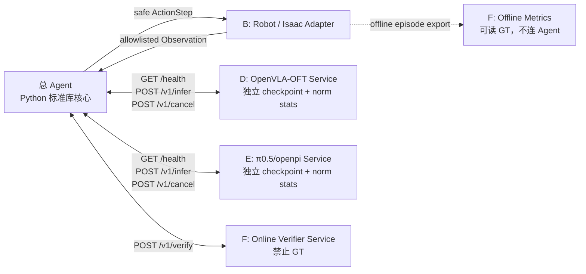

# 总 Agent 跨进程接口契约

契约版本：1.0
状态：冻结基线；Mock 已实现，真实模型服务待 D/E 对接
规范关键词：必须（MUST）、禁止（MUST NOT）、应该（SHOULD）、可以（MAY）

## 1. 文档目的

本文使 A、B、D、E、F 能在不同 Python/CUDA/JAX 环境中独立开发：

| 负责人 | 服务/接口 | 输入 | 输出 |
|---|---|---|---|
| A | 总 Agent | TaskSchema、在线 Observation | TaskPlan、动作调度、事件 |
| B | 仿真/机器人环境 | 已安全校验的 ActionStep | 新 Observation、safe-stop ack |
| D | OpenVLA-OFT 服务 | 图像、状态、自然语言子指令 | 统一 7 维 ActionChunk |
| E | π0.5/openpi 服务 | openpi observation、prompt | 统一 7 维 ActionChunk |
| F | Verifier/评测 | 在线帧 + 后置条件 | PASS/FAIL/UNCERTAIN；GT 仅离线 |

真实 OpenVLA-OFT 与 π0.5 尚未在本仓库集成。`executor.py` 是传输无关
Protocol 和适配骨架，不应被描述为真实模型已可用。

机器可校验文件：

| 接口 | Schema |
|---|---|
| 配置 | `schemas/agent-config.schema.json` |
| Health | `schemas/executor-health.schema.json` |
| Infer | `schemas/executor-infer.schema.json` |
| Cancel | `schemas/executor-cancel.schema.json` |
| 在线 Observation | `schemas/online-observation.schema.json` |
| 7D ActionChunk | `schemas/action-chunk.schema.json` |
| Verify | `schemas/verify.schema.json` |
| Task/TaskPlan/Event | `schemas/task.schema.json`、`task-plan.schema.json`、`event.schema.json` |

## 2. 进程拓扑

推荐每个模型一个容器或独立虚拟环境：



OpenVLA-OFT 与 π0.5 服务对总 Agent 暴露同一 URL 路径，但监听不同地址，
例如：

- OpenVLA-OFT：`http://127.0.0.1:8101`
- π0.5：`http://127.0.0.1:8102`
- Verifier：`http://127.0.0.1:8201`

禁止让总 Agent 通过同一 Python 解释器导入两个模型仓库。

## 3. 传输与编码

### 3.1 HTTP 基线

- HTTP/1.1 或 HTTP/2；
- JSON 使用 UTF-8，`Content-Type: application/json`；
- 时间戳为 Unix epoch 毫秒；
- 服务端必须支持连接保活；
- TLS 在跨主机部署时必须启用；
- 服务端不得接受 NaN、Infinity 或 `-Infinity` JSON 扩展；
- 字段名使用 `snake_case`；
- 未知顶层字段在主版本 1 中必须拒绝，不能静默解释。

`ProcessTransport` 实现必须在 4xx/5xx 时仍解析并返回符合本契约的错误 body，
不能只抛弃 body 后抛通用 HTTP 异常；连接失败和 deadline 超时可以抛异常。
这样总 Agent 才能保留 `EXEC_210x` 等稳定错误码与 `retryable` 语义。

建议请求头：

```http
Content-Type: application/json
Accept: application/json
X-Trace-Id: 018f...
Idempotency-Key: 67ba...
X-Contract-Version: 1.0
```

HTTP body 中仍必须携带相同 `trace_id` 和 `request_id`，便于不经过 HTTP
网关的 WebSocket/Unix socket 复用。

### 3.2 WebSocket 可选传输

图像频率较高时，D/E 可以额外提供 `WS /v1/stream`。业务消息仍使用本文
相同 infer request/response JSON：

```json
{
  "message_type": "infer.request",
  "payload": {
    "schema_version": "1.0",
    "request_id": "req-00042"
  }
}
```

服务端响应：

```json
{
  "message_type": "infer.response",
  "payload": {
    "schema_version": "1.0",
    "request_id": "req-00042",
    "status": "ok"
  }
}
```

WebSocket 要求：

- 同一连接最多 2 个未完成 infer；默认仅 1 个；
- 每个响应必须回显 `request_id`；
- 服务端按请求独立超时，不能因前一个请求失败关闭所有任务；
- 收到 cancel 后可发送 `infer.response/status=cancelled`；
- 心跳建议 10 秒，连续 3 次心跳失败则连接不可用；
- 二进制图像帧必须用 manifest 引用，不允许靠消息到达顺序隐式配对。

HTTP 是验收必需项，WebSocket 不是。

## 4. 公共标识与版本字段

| 字段 | 类型 | 产生方 | 生命周期/规则 |
|---|---|---|---|
| `schema_version` | string | 调用方 | `MAJOR.MINOR`，当前 `1.0` |
| `request_id` | string/UUID | 调用方 | 单次业务请求唯一，也是幂等键 |
| `trace_id` | string/UUID | 总 Agent | 一条跨服务调用链保持不变 |
| `episode_id` | string/UUID | 总 Agent | 一次 `IndustrialAgent.run` |
| `task_id` | string | 总 Agent | 当前可执行任务 ID；子任务实现中为 `parent:Sxx` |
| `subtask_id` | string | TaskPlan | 计划内稳定，如 `S02_PLACE` |
| `step_id` | integer | 总 Agent | 子任务内动作块序号，从 0 开始 |
| `observation_id` | string | B/环境 | 一个在线传感器快照唯一 |
| `chunk_id` | string/UUID | D/E | 一个模型动作块唯一 |
| `checkpoint_sha` | string | D/E 配置 | 实际权重不可变摘要/提交 SHA |
| `norm_stats_sha` | string | D/E 配置 | 实际归一化统计文件摘要 |

`checkpoint_sha` 和 `norm_stats_sha` 必须独立管理。它们不能使用 `latest`、
目录名或人工版本昵称代替。请求声明期望 SHA，响应回显实际 SHA；不一致时
服务必须拒绝推理，返回 HTTP 409 与
`EXEC_2105_MODEL_REVISION_MISMATCH`。

## 5. 公共错误响应

任何非 2xx 响应使用：

```json
{
  "schema_version": "1.0",
  "request_id": "req-00042",
  "trace_id": "trace-9001",
  "status": "error",
  "error": {
    "code": "EXEC_2106_BACKPRESSURE",
    "message": "inference queue is full",
    "retryable": true,
    "retry_after_ms": 500,
    "details": {
      "queue_depth": 2,
      "queue_capacity": 2
    }
  }
}
```

`message` 用于人读，不得据此写分支；Agent 只依据 `code` 和 HTTP 状态。
`details` 不得包含密钥、完整图像、GT 或模型隐藏推理。

## 6. `GET /health`

### 6.1 目的

只报告进程、模型和依赖是否已经可接收请求。不得触发懒加载后立刻返回
ready；如仍在加载，返回 200 + `status=loading`。

### 6.2 成功响应

JSON Schema：`schemas/executor-health.schema.json`

```json
{
  "schema_version": "1.0",
  "service": "openvla_oft",
  "service_version": "0.1.0",
  "status": "ready",
  "uptime_ms": 183420,
  "checkpoint_sha": "sha256:8c148c148c148c148c148c148c148c148c148c148c148c148c148c148c148c14",
  "norm_stats_sha": "sha256:a930a930a930a930a930a930a930a930a930a930a930a930a930a930a930a930",
  "supported_task_types": [
    "object_localization",
    "pick_place",
    "visual_manipulation"
  ],
  "supported_action_contracts": [
    "1.0"
  ],
  "queue": {
    "depth": 0,
    "capacity": 2
  },
  "device": {
    "kind": "cuda",
    "name": "redacted-or-operational-name"
  },
  "time_ms": 1784901000123
}
```

π0.5 将 `service` 改为 `pi05`，必须返回自己的 SHA，不得复用 OpenVLA
配置。

### 6.3 HTTP 状态

| HTTP | 条件 |
|---:|---|
| 200 | ready/loading/degraded 均可表达 |
| 503 | 进程无法服务或模型加载失败 |

总 Agent 只有在 `HTTP 200` 且 `status=ready` 时才路由到该服务。
此外必须同时校验 `schema_version` 主版本、`service`、
`checkpoint_sha`、`norm_stats_sha`，并确认
`supported_action_contracts` 包含配置的动作合同版本。任一项缺失或不一致均
视为不健康，不得参与路由；Agent 不得用本地配置覆盖服务实际返回值。

## 7. `POST /v1/infer`

### 7.1 公共请求信封

JSON Schema：`schemas/executor-infer.schema.json#/$defs/request`

```json
{
  "schema_version": "1.0",
  "request_id": "req-00042",
  "trace_id": "trace-9001",
  "episode_id": "episode-17",
  "task_id": "job-3:S02_PLACE",
  "subtask_id": "S02_PLACE",
  "step_id": 0,
  "observation_id": "obs-1029",
  "deadline_ms": 15000,
  "executor": "openvla_oft",
  "checkpoint_sha": "sha256:8c148c148c148c148c148c148c148c148c148c148c148c148c148c148c148c14",
  "norm_stats_sha": "sha256:a930a930a930a930a930a930a930a930a930a930a930a930a930a930a930a930",
  "expected_action_contract": "1.0",
  "model_input": {}
}
```

| 字段 | 必需 | 校验 |
|---|---|---|
| schema/request/trace/episode/task/subtask IDs | 是 | 非空，响应原样回显 |
| `step_id` | 是 | 非负整数 |
| `observation_id` | 是 | 必须对应 model_input 使用的同一帧 |
| `deadline_ms` | 是 | 从服务收到请求起的预算，建议 1000–30000 |
| `executor` | 是 | 必须与目标服务一致 |
| `checkpoint_sha` | 是 | 与实际加载权重完全一致 |
| `norm_stats_sha` | 是 | 与实际归一化统计完全一致 |
| `expected_action_contract` | 是 | 当前为 `1.0` |
| `model_input` | 是 | 服务类型专属 |

服务不得用当前最新帧替换请求指定的 `observation_id`。

### 7.2 OpenVLA-OFT `model_input`

该服务包装上游 OpenVLA-OFT。输入对齐
`full_image`、`wrist_image`、`state`、`task_description`，输出连续
action chunk，再由 D 的服务转换为统一 7 维合同。

```json
{
  "model_input": {
    "full_image": {
      "encoding": "jpeg",
      "uri": "shm://episode-17/full/obs-1029",
      "width": 640,
      "height": 480,
      "sha256": "4cb1..."
    },
    "wrist_image": {
      "encoding": "jpeg",
      "uri": "shm://episode-17/wrist/obs-1029",
      "width": 640,
      "height": 480,
      "sha256": "9d11..."
    },
    "state": [
      0.51,
      -0.03,
      0.42,
      0.01,
      0.02,
      -0.01,
      0.0
    ],
    "task_description": "将已确认的红色工件放入指定格 A3"
  }
}
```

要求：

- `full_image` 必需；
- `wrist_image` 是否必需由 health 的 capability 声明；
- `state` 维度和顺序由 D 的服务版本冻结，并在启动日志记录；
- D 必须在服务内使用自己的 `norm_stats_sha` 反归一化；
- D 不得让 Agent 猜测模型原生动作顺序；
- D 转成统一合同后才响应。

### 7.3 π0.5/openpi `model_input`

该服务包装上游 openpi policy server / `policy.infer(...)["actions"]`。

```json
{
  "model_input": {
    "prompt": "将已装满的料箱搬运至叠放区",
    "observation": {
      "observation_version": "1.0",
      "observation_id": "obs-1029",
      "timestamp_ms": 1784901000123,
      "camera": {
        "full_image": {
          "encoding": "jpeg",
          "uri": "shm://episode-17/full/obs-1029",
          "sha256": "4cb1..."
        }
      },
      "robot": {
        "tcp_pose_m_rad": [
          0.51,
          -0.03,
          0.42,
          0.01,
          0.02,
          -0.01
        ],
        "state": [
          0.51,
          -0.03,
          0.42,
          0.01,
          0.02,
          -0.01,
          0.0
        ]
      },
      "safety": {
        "emergency_stop": false,
        "protective_stop": false,
        "system_fault": null
      },
      "quality": {
        "confidence": 0.98
      }
    }
  }
}
```

要求：

- E 负责将 canonical Observation 映射到 openpi/LeRobot 输入；
- E 使用自己的 norm stats，不能读取 D 的统计；
- 内部 `policy.infer(...)[\"actions\"]` 必须转成统一 7 维 chunk；
- 如果模型动作空间无法无损转换，服务必须返回不兼容错误，禁止补零猜测；
- 对相机字段和 state 的实际要求必须在服务 README 与 health 中声明。

### 7.4 成功响应

JSON Schema：`schemas/executor-infer.schema.json#/$defs/response`

```json
{
  "schema_version": "1.0",
  "request_id": "req-00042",
  "trace_id": "trace-9001",
  "episode_id": "episode-17",
  "task_id": "job-3:S02_PLACE",
  "subtask_id": "S02_PLACE",
  "step_id": 0,
  "observation_id": "obs-1029",
  "executor": "openvla_oft",
  "checkpoint_sha": "sha256:8c148c148c148c148c148c148c148c148c148c148c148c148c148c148c148c14",
  "norm_stats_sha": "sha256:a930a930a930a930a930a930a930a930a930a930a930a930a930a930a930a930",
  "status": "ok",
  "action_chunk": {
    "contract_version": "1.0",
    "chunk_id": "chunk-a189",
    "task_id": "job-3:S02_PLACE",
    "executor": "openvla_oft",
    "action_space": "ee_delta_pose_gripper",
    "frame": "robot_base",
    "translation_unit": "m",
    "rotation_unit": "rad",
    "gripper_unit": "normalized",
    "steps": [
      {
        "values": [
          0.008,
          -0.002,
          0.004,
          0.01,
          0.0,
          -0.01,
          0.4
        ],
        "duration_ms": 100
      }
    ]
  },
  "timing": {
    "queue_ms": 3,
    "inference_ms": 82,
    "total_ms": 89
  }
}
```

服务端必须原样回显所有关联 ID。Agent 必须拒绝 task/executor 不匹配、
主版本不匹配、空 chunk、非 7 维或非有限动作。

### 7.6 单步滚动执行规则

服务可以返回多步 `action_chunk`，但总 Agent 默认只执行该响应的第 1 个
`ActionStep`。动作后必须获得新的、未使用过的 `observation_id` 并重新核验；
若后置条件未满足且仍在有界决策预算内，Agent 丢弃旧 chunk 剩余动作并使用
新帧再次调用 `/v1/infer`。禁止在没有新观测和新决策的情况下连续下发旧
chunk 的第 2 步及以后动作。

这一规则是执行安全策略，不改变服务响应 Schema。D/E 仍应输出模型的完整
chunk 以便离线分析，但在线日志必须记录 `proposed_steps`、
`executed_steps=1` 和 `discarded_steps`。

`action_chunk` 必须完整符合 canonical Schema。Agent 必须读取并校验其中的
`contract_version`、`task_id`、`executor`、`action_space`、坐标系和全部单位，
并保留每一步原始 `duration_ms`；禁止丢弃服务元数据后用本地默认值重建一个
“看似合法”的 chunk。`timing` 是可选的非负耗时对象。

`status=error/cancelled` 时必须回显同一组关联 ID、权重和 norm 摘要，携带
`error.code/message/retryable`，且不得同时携带 `action_chunk`。Agent 对稳定
错误码原样映射到 `FailureCode`；未知错误码或不满足条件分支的响应统一视为
`EXEC_2103_BAD_RESPONSE`。

### 7.5 统一动作字段

固定顺序：

```text
[dx_m, dy_m, dz_m, droll_rad, dpitch_rad, dyaw_rad, gripper_norm]
```

`duration_ms` 是控制元数据，不是第八维。动作值的物理含义：

| 索引 | 名称 | 单位 | 坐标系 |
|---:|---|---|---|
| 0 | dx | m | robot_base |
| 1 | dy | m | robot_base |
| 2 | dz | m | robot_base |
| 3 | delta roll | rad | robot_base 增量 |
| 4 | delta pitch | rad | robot_base 增量 |
| 5 | delta yaw | rad | robot_base 增量 |
| 6 | gripper | normalized `[-1,1]` | 项目统一语义 |

夹爪正负方向必须由 B/D/E 共同冻结。当前安全器只保证范围，不替团队决定
“+1 是张开还是闭合”。该语义冻结后若改变，必须提升 action contract 主版本。

## 8. `POST /v1/cancel`

JSON Schema：`schemas/executor-cancel.schema.json`

### 8.1 请求

```json
{
  "schema_version": "1.0",
  "request_id": "cancel-0042",
  "trace_id": "trace-9001",
  "episode_id": "episode-17",
  "task_id": "job-3:S02_PLACE",
  "subtask_id": "S02_PLACE",
  "reason": "postcondition failed; replan current subtask"
}
```

### 8.2 成功响应

```json
{
  "schema_version": "1.0",
  "request_id": "cancel-0042",
  "trace_id": "trace-9001",
  "task_id": "job-3:S02_PLACE",
  "status": "cancelled",
  "cancelled_request_ids": [
    "req-00042"
  ],
  "server_context_cleared": true
}
```

取消语义：

1. cancel 是幂等的；重复请求必须返回同一最终状态；
2. 服务必须停止尚未开始的排队推理；
3. 已在 GPU 执行且无法抢占时，可以完成计算但必须丢弃结果；
4. cancel ack 后不得再把旧 action chunk 当成功响应发送；
5. 服务必须清理该 task 的缓存/动作上下文；
6. 总 Agent 无论 cancel 是否成功都会清空本地动作队列；
7. cancel 超时不允许阻止系统故障的 `safe_stop`。

若目标已完成，仍返回 200，`status=already_completed`；若从未见过该 ID，
返回 200，`status=not_found`，保持幂等。

## 9. `POST /v1/verify`

本核心默认在进程内执行 `PostconditionVerifier`。F 若独立部署在线 Verifier，
必须使用本接口；该在线进程禁止挂载 GT 数据。

JSON Schema：`schemas/verify.schema.json`

### 9.1 请求

```json
{
  "schema_version": "1.0",
  "request_id": "verify-88",
  "trace_id": "trace-9001",
  "episode_id": "episode-17",
  "task_id": "job-3:S02_PLACE",
  "subtask_id": "S02_PLACE",
  "step_id": 0,
  "postconditions": [
    {
      "kind": "object_in_zone",
      "object_id": "red_part",
      "zone_id": "slot-A3",
      "min_confidence": 0.6,
      "required_votes": 2
    }
  ],
  "observations": [
    {
      "observation_version": "1.0",
      "observation_id": "obs-1030",
      "timestamp_ms": 1784901000200,
      "objects": [
        {
          "object_id": "red_part",
          "zone_id": "slot-A3",
          "confidence": 0.94
        }
      ],
      "robot": {
        "tcp_pose_m_rad": [
          0.5,
          0.0,
          0.5,
          0.0,
          0.0,
          0.0
        ]
      },
      "safety": {
        "emergency_stop": false,
        "protective_stop": false,
        "system_fault": null
      },
      "quality": {
        "confidence": 0.94
      }
    }
  ]
}
```

生产默认发 3 帧；示例为简洁只展示 1 帧。实际帧数必须不小于条件的
`required_votes`，否则只能得到 UNCERTAIN。

### 9.2 响应

```json
{
  "schema_version": "1.0",
  "request_id": "verify-88",
  "trace_id": "trace-9001",
  "episode_id": "episode-17",
  "task_id": "job-3:S02_PLACE",
  "subtask_id": "S02_PLACE",
  "step_id": 0,
  "verdict": "PASS",
  "failure_code": "NONE",
  "conditions": [
    {
      "kind": "object_in_zone",
      "verdict": "PASS",
      "pass_votes": 2,
      "fail_votes": 1,
      "uncertain_votes": 0,
      "required_votes": 2,
      "evidence_observation_ids": [
        "obs-1030",
        "obs-1031"
      ]
    }
  ]
}
```

Verifier 规则：

- `PASS`：所有条件达到 PASS 票数；
- `FAIL`：至少一项达到 FAIL 票数；
- `UNCERTAIN`：没有达到 PASS/FAIL 阈值；
- 字段缺失、类型不对、低置信度都是 UNCERTAIN；
- `UNCERTAIN` 不能推进子任务；
- 在线响应禁止包含 GT、oracle、人工标签或隐藏评测分数。
- 同一请求内 `observation_id` 必须唯一且时间戳不得倒退；重复帧只能得到
  `UNCERTAIN/OBS_1101_INVALID`，不能重复计票。

## 10. B 的环境接口

核心 Python Protocol：

```python
class ExecutionEnvironment(Protocol):
    def observe(self) -> Mapping[str, Any]: ...
    def step(self, action: ActionStep) -> Mapping[str, Any]: ...
    def safe_stop(self, reason: str) -> None: ...
```

`step` 只接收已经安全校验的一步动作，返回执行后的新在线 Observation。
`safe_stop` 必须停止运动并清理控制器缓冲；它不能只设置软件标志。

若 B 需要跨进程部署，建议映射：

| Python | HTTP |
|---|---|
| `observe()` | `GET /v1/observation` |
| `step(action)` | `POST /v1/step` |
| `safe_stop(reason)` | `POST /v1/safe-stop` |

B 必须在每帧提供：

- `observation_id` 和时间戳；
- `robot.tcp_pose_m_rad` 至少 6 个有限数；
- `safety.emergency_stop`；
- `safety.protective_stop`；
- `safety.system_fault`；
- 后置条件所需的对象/区域/任务传感字段。

### GT 隔离

B/C 可以在仿真内部保留 GT，用于 F 离线评测，但发给 Agent 的在线响应禁止
出现以下任意层级键或 snake_case/camelCase/PascalCase/连字符/空格复合变体：
`gt`、`*_gt_*`、`ground_truth*`、`truth*`、`label(s)`、`annotation(s)`、`oracle*`、
`privileged_state`；也禁止 `target_pose`、`desiredPose`、`actualPose`、
`grasp_point`、`targetX`、`targetMatrix`、`waypoint` 等越权目标几何。
target/desired/goal/grasp/actual 等引用容器内的任意数值标量、向量或矩阵也
一律禁止，不能用 `value`/`data` 等无语义键绕过。Agent 会以
`OBS_1102_GT_FORBIDDEN` 拒绝整个帧。常见复数和数字后缀同样归一化处理；
该 fail-closed 策略也会拒绝引用容器内的计数等高层数值，需将其迁移到双方
冻结、且不处于引用上下文的传感字段。
首次动作前拒帧不得产生运动；一旦 run 已执行过动作，后续任意阶段拒帧必须
调用 `safe_stop()` 并进入 `SAFE_STOPPED`，不得重试或切换执行器。`robot`、
完整 `safety`、run 内唯一 `observation_id` 和不倒退时间戳均为强制项。

## 11. 幂等、重试、超时与截止时间

### 11.1 幂等

- `request_id` 同时作为业务幂等键；
- 相同 `request_id` + 相同 body：服务应在至少 10 分钟内返回同一响应；
- 相同 `request_id` + 不同 body：HTTP 409，
  `TASK_1001_INVALID` 或服务专属冲突码；
- infer 响应缓存必须包含实际 `checkpoint_sha` 和 `norm_stats_sha`；
- Agent 重试传输时复用原 `request_id`；
- Agent 业务重规划时产生新 `request_id` 和递增 `step_id/replan_index`。

### 11.2 超时预算

建议默认：

| 调用 | 连接超时 | 总截止 |
|---|---:|---:|
| GET /health | 300 ms | 1000 ms |
| POST /v1/infer | 1000 ms | 15000 ms |
| POST /v1/cancel | 300 ms | 1000 ms |
| POST /v1/verify | 500 ms | 3000 ms |

调用方超时后立即发送 cancel。服务端若预计无法在 `deadline_ms` 内开始推理，
应尽早返回 429/503，而不是等到截止时间。

### 11.3 重试

传输层仅在以下条件自动重试一次：

- 连接建立失败；
- 502/503/504 且响应声明 `retryable=true`；
- 429 且提供 `retry_after_ms`，并且仍在总截止时间内。

400/409/413、合同错误、模型版本不匹配、NaN/动作错误禁止自动重试。
业务层重规划和传输重试是两个概念，必须用不同事件记录。

## 12. 背压与消息大小

默认限制：

| 项目 | 限制 |
|---|---:|
| 单服务进行中 infer | 1 |
| 单服务排队 infer | 2 |
| JSON body | 16 MiB |
| 单张压缩图像 | 6 MiB |
| 单 infer 全部图像 | 12 MiB |
| action chunk steps | 32 |
| verifier frames | 9 |
| instruction UTF-8 | 2000 字符 |

超过 body 限制返回 HTTP 413 /
`OBS_1103_PAYLOAD_TOO_LARGE`。队列满返回 HTTP 429 /
`EXEC_2106_BACKPRESSURE`，并提供 `Retry-After` 与 `retry_after_ms`。

推荐图像传输优先级：

1. 同主机共享内存 URI + SHA256；
2. 有鉴权、短时效的对象 URI；
3. HTTP multipart；
4. base64 JSON 仅用于 Mock/调试。

服务必须在推理前校验图像 SHA；URI 过期或摘要不符视为 observation 无效。

## 13. HTTP 状态与稳定错误码

| HTTP | 错误码 | 含义 | Agent 行为 |
|---:|---|---|---|
| 400 | `TASK_1001_INVALID` | Task/请求字段非法 | 当前策略恢复；不可传输重试 |
| 400 | `OBS_1101_INVALID` | 在线帧非法 | 失败并记录 |
| 403 | `OBS_1102_GT_FORBIDDEN` | 在线帧含 GT | 立即失败，调查数据管线 |
| 413 | `OBS_1103_PAYLOAD_TOO_LARGE` | 负载超限 | 调整编码，不自动重试 |
| 400 | `ACT_1201_CONTRACT_INVALID` | 动作合同错误 | 拒绝动作，允许有界恢复 |
| 400 | `ACT_1202_NON_FINITE` | NaN/Inf | 拒绝动作，允许有界恢复 |
| 409 | `ACT_1203_WORKSPACE_BREACH` | 预测越界 | 拒绝动作，允许有界恢复 |
| 503 | `ROUTE_2001_NO_COMPATIBLE_EXECUTOR` | 无兼容执行器 | FAILED |
| 503 | `EXEC_2101_UNAVAILABLE` | 服务不可用 | 有界恢复/切换 |
| 504 | `EXEC_2102_TIMEOUT` | 推理超时 | cancel + 有界恢复 |
| 502 | `EXEC_2103_BAD_RESPONSE` | 响应不符合合同 | 有界恢复/切换 |
| 500 | `EXEC_2104_RUNTIME` | 模型运行错误 | 按 retryable 决定 |
| 409 | `EXEC_2105_MODEL_REVISION_MISMATCH` | 权重或 norm SHA 不同 | 禁止执行，人工修复配置 |
| 429 | `EXEC_2106_BACKPRESSURE` | 队列已满 | 截止内退避一次 |
| 200/409 | `EXEC_2107_CANCELLED` | 请求已取消 | 丢弃任何旧动作 |
| 422 | `VERIFY_3001_POSTCONDITION_FAILED` | 后置条件失败 | 当前子任务有界恢复 |
| 200 | `VERIFY_3002_UNCERTAIN` | 票数不足/低置信 | 当前子任务有界恢复 |
| 503 | `VERIFY_3003_UNAVAILABLE` | 在线核验不可用 | 不得当成功 |
| 409 | `RECOVERY_3101_EXHAUSTED` | 恢复预算耗尽 | FAILED |
| 423 | `SAFE_9001_EMERGENCY_STOP` | 急停 | 立即 SAFE_STOPPED |
| 423 | `SAFE_9002_PROTECTIVE_STOP` | 保护停 | 立即 SAFE_STOPPED |
| 500 | `SAFE_9003_SYSTEM_FAULT` | 系统故障 | 立即 SAFE_STOPPED |
| 409 | `SAFE_9004_ACTION_REJECTED` | 安全门拒绝 | 不下发动作 |

安全类错误优先级高于其他错误。即使 infer 同时超时，只要新帧显示急停，结果
必须为 SAFE_STOPPED，而不是普通超时。

## 14. 兼容性规则

### 14.1 Schema 版本

- `MAJOR` 不同：必须拒绝；
- `MAJOR` 相同、调用方 minor 小于服务端：服务只使用调用方声明字段；
- `MAJOR` 相同、调用方 minor 大于服务端：若出现未知必需字段，拒绝；
- 主版本 1 的请求顶层未知字段默认拒绝；
- 响应增加可选字段只提升 minor；
- 删除/重命名字段、修改单位、修改维度或夹爪语义必须提升 major。

### 14.2 模型与动作版本

兼容性必须同时满足：

```text
schema major compatible
AND expected_action_contract major supported
AND checkpoint_sha exact match
AND norm_stats_sha exact match
AND executor name exact match
```

任意一项不满足都不能执行动作。

部署时，`build_executors_from_config(config, transport_factory)` 必须消费配置中的
`base_url` 并构建对应 transport；`IndustrialAgent.from_config(...)` 随后对实际
descriptor 的 executor name、动作合同、checkpoint SHA 和 norm stats SHA 做精确
启动校验。禁止在 transport 内静默改写配置 URL，也禁止用服务响应覆盖期望摘要。
只有 `enabled: true` 的服务会被构建；传入 Agent 的执行器名称集合必须与所有
启用项完全一致并至少包含一项。

### 14.3 变更流程

1. 先更新 JSON Schema 和本文件；
2. 添加旧客户端/新服务与新客户端/旧服务契约测试；
3. D/E/B/F 分别确认；
4. 更新 mock fixture；
5. 合并代码；
6. 最后才更新生产配置。

## 15. 可观测性

服务日志每条至少包含：

`time_ms`、`service`、`service_version`、`request_id`、`trace_id`、
`episode_id`、`task_id`、`subtask_id`、`step_id`、`observation_id`、
`checkpoint_sha`、`norm_stats_sha`、`status/error.code`、各阶段耗时。

禁止日志：

- 完整 base64 图像；
- OAuth/token/密码；
- GT 与人工标签；
- 模型隐藏思维链；
- 未脱敏个人信息。

Agent 事件 Schema 见 `schemas/event.schema.json`。跨服务排障以 `trace_id`
关联，run 内排序以事件 `sequence` 为准，不能只依赖不同主机时钟。

## 16. 安全与认证

- 跨主机必须 TLS；
- 服务只监听受控网段，默认不暴露公网；
- 建议 mTLS 或短期服务 token；
- 图像 URI 必须限定协议和主机 allowlist，防止 SSRF；
- 服务不得跟随任意重定向；
- 请求体解压后也必须受 16 MiB 限制；
- instruction 仅作为模型数据，禁止拼接 shell；
- `checkpoint_sha`/`norm_stats_sha` 来自只读部署配置；
- `safe-stop` 的授权优先级高于普通 infer，不能因推理队列满被拒绝。

## 17. 各负责人联调清单

### D：OpenVLA-OFT

- [ ] 独立进程可启动，`GET /health` 回显真实 SHA；
- [ ] 输入接收 full/wrist image、state、task description；
- [ ] 上游连续动作 chunk 映射到统一 7 维合同；
- [ ] 自己的 norm stats 反归一化有单元测试；
- [ ] cancel 后旧 chunk 不再返回；
- [ ] 固定输入的 action shape、单位、范围测试通过；
- [ ] 不声称真实模型接入，直到端到端日志和权重摘要齐全。

### E：π0.5/openpi

- [ ] 独立 JAX/openpi 进程可启动；
- [ ] LeRobot/openpi observation 映射固定；
- [ ] `policy.infer(...)["actions"]` 转换为统一 7 维合同；
- [ ] 自己的 checkpoint/norm stats SHA 可追溯；
- [ ] action chunk、cancel、超时和背压测试通过；
- [ ] 与 D 环境、端口、缓存完全隔离。

### B：仿真/机器人

- [ ] `observe/step/safe_stop` 语义符合本文；
- [ ] 每步返回新的 observation ID；
- [ ] 急停、保护停、系统故障字段始终存在；
- [ ] 控制器执行前再次做自身安全检查；
- [ ] safe-stop 确实清理控制器缓冲；
- [ ] 坐标系、单位、夹爪正负方向冻结；
- [ ] 在线输出通过 GT 深度扫描。

### F：验证/评测

- [ ] 在线 Verifier 只挂载在线帧；
- [ ] 3 帧 2 票规则与核心实现一致；
- [ ] FAIL 与 UNCERTAIN 可区分；
- [ ] 离线 GT 评测进程网络上不能成为 Agent 数据源；
- [ ] 事件、证据帧 ID、失败码写入报告；
- [ ] 成功/恢复/切换/安全停止都有回放用例。

### A：总 Agent

- [ ] TaskPlan 只有语义字段；
- [ ] 每个子任务后重新感知和核验；
- [ ] 失败只重试当前子任务；
- [ ] 同策略最多一次重规划、全程最多一次切换、不切回；
- [ ] 所有恢复路径清空动作队列；
- [ ] 系统故障立即 safe-stop；
- [ ] 所有跨进程响应做 ID、版本、SHA、动作合同校验。

## 18. 最小契约测试矩阵

| 用例 | 预期 |
|---|---|
| health ready + SHA 一致 | 可路由 |
| health loading/degraded | 不路由 |
| checkpoint SHA 不同 | 409，不推理 |
| norm stats SHA 不同 | 409，不推理 |
| 相同 request ID/相同 body | 同一响应 |
| 相同 request ID/不同 body | 409 |
| 动作 6/8 维 | ACT_1201 |
| 动作含 NaN/Inf | ACT_1202 |
| 动作轴超限但工作空间内 | 限幅并记录 |
| 限幅后仍越工作空间 | ACT_1203，整块不执行 |
| observation 含嵌套 ground_truth | OBS_1102 |
| observation 含 groundTruth/targetPose/targetX/target.value 变体 | OBS_1102 |
| 3 帧中 2 PASS | PASS |
| PASS 与 FAIL 同时达到投票阈值 | FAIL（fail-closed） |
| 帧/目标置信度或 numeric_range 值为布尔/NaN/Inf | UNCERTAIN，不得 PASS |
| 仅 1 PASS，其余低置信 | UNCERTAIN |
| cancel 先于响应 | 旧 chunk 丢弃 |
| 2-step chunk，第 1 步改变场景 | 第 2 步前必须用新 observation_id 再 infer |
| 重复 observation_id 投票 | UNCERTAIN/OBS_1101，不得 PASS |
| 缺失 safety 任一字段 | fail-closed / SAFE_STOPPED |
| 已满足 repeat-until 条件 | 零动作完成并推进 |
| 队列满 | 429 + retry_after_ms |
| 动作后系统故障 | 立即 SAFE_STOPPED，不核验 |
| 动作后控制/循环/核验 observation 非法或含 GT | safe_stop + SAFE_STOPPED |
| 子任务 2 首次失败 | 只重试子任务 2，子任务 1 不重跑 |
