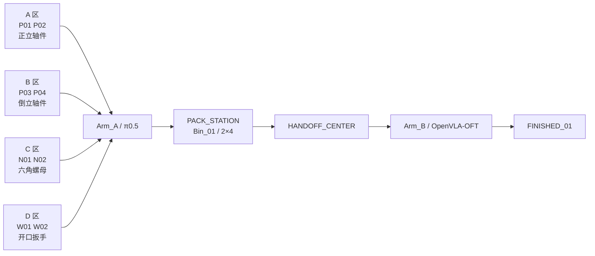

# V2 双臂单箱人工工业采集场景

> 日期：2026-08-18
>
> 场景 ID：`single_bin_manual_industrial_v2`
>
> 状态：源码和静态合同已实现；GUI/物理/IK/抓取/搬运证据待补齐

本文描述当前 V2 工业场景。旧版四轴件、`2×3` 料箱和
`single_bin_pack_handoff_v1` 已废除，仅作为历史证据保留，详见
[场景与流程总说明](final-frozen-scene-and-flow.md)。

## 1. 场景冻结

| 项目 | V2 当前定义 |
|---|---|
| 机器人 | 两台 Franka：`Arm_A`、`Arm_B` |
| 相机 | `CAM_A_TOP`、`CAM_HANDOFF`、`CAM_B_TOP` |
| 零件 | 4 轴件 + 2 螺母 + 2 扳手，共 8 件 |
| 初始姿态 | P01/P02 正立；P03/P04 倒立；N01/N02、W01/W02 平放 |
| 区域 | A/B/C/D 各 2 件 |
| 料箱 | 1 个 `0.30×0.22×0.09 m` 的 `2×4` 料箱 |
| 槽位 | S11-S24 固定映射，每格 1 件 |
| 搬运结构 | 中央提梁 `Carry_Handle`，TCP 为 `BIN_CARRY_TCP` |
| 采集 | 可见 GUI、人工键盘、有效样本频率 `10 Hz` |
| GT | 在线禁止；只允许离线保存和评测 |

## 2. 顶层布局



图只表达区域和任务方向，不替代 JSON 坐标合同，也不证明 IK 可达。

## 3. 世界坐标与节点

坐标单位为米，Stage 为 Z-up，工作台面高度 `0.750 m`。机器真源是
`simulation/configs/single_bin_scene_v2.json`。

| 对象 | Prim/ID | 初始位置 `(x,y,z)` |
|---|---|---:|
| 工作台 | `/World/Workcell/Table` | `(0.00,0.00,0.725)` |
| Arm_A | `/World/Robots/Arm_A` | `(-0.55,-0.30,0.750)` |
| Arm_B | `/World/Robots/Arm_B` | `(+0.50,-0.30,0.750)` |
| Bin_01 | `/World/Bins/Bin_01` | `(-0.35,-0.15,0.795)` |
| PACK_STATION | `/World/Stations/PACK_STATION` | `(-0.35,-0.15,0.785)` |
| HANDOFF_CENTER | `/World/Stations/HANDOFF_CENTER` | `(0.00,0.00,0.785)` |
| FINISHED_01 | `/World/Stations/FINISHED_01` | `(+0.70,+0.10,0.785)` |

机器人显式 HOME：

```text
arm joints = [0.01199996, -0.56927347, 0.00000009,
              -2.81087494, 0.00000669, 3.03692675, 0.741]
fingers    = [0.04, 0.04] m
```

## 4. 工业零件

| 零件 | 类型 | 区域 | 初始位置 `(x,y,z)` | 初始姿态 |
|---|---|---|---:|---|
| P01 | 轴件 | A | `(-0.90,+0.20,0.777)` | 正立 |
| P02 | 轴件 | A | `(-0.80,+0.20,0.777)` | 正立 |
| P03 | 轴件 | B | `(-0.65,+0.20,0.777)` | 倒立，roll=180° |
| P04 | 轴件 | B | `(-0.55,+0.20,0.777)` | 倒立，roll=180° |
| N01 | 六角螺母 | C | `(-0.90,0.00,0.760)` | 平放 |
| N02 | 六角螺母 | C | `(-0.80,0.00,0.760)` | 平放，yaw=30° |
| W01 | 开口扳手 | D | `(-0.65,0.00,0.755)` | 沿 Y 平放 |
| W02 | 开口扳手 | D | `(-0.55,0.00,0.755)` | 沿 Y 平放 |

资产由 `v2_industrial_assets.py` 程序化生成，不依赖外部零件网格。螺母必须保留
真实可见通孔，扳手必须保留平行手柄和开口端，不能用无语义的方块代替。

## 5. 料箱、槽位与质量预算

| 槽位 | 零件 | Profile | 局部中心 `(x,y,z)` |
|---|---|---|---:|
| S11 | P01 | shaft | `(-0.1125,+0.055,0)` |
| S12 | P03 | shaft | `(-0.0375,+0.055,0)` |
| S13 | N01 | nut | `(+0.0375,+0.055,0)` |
| S14 | W01 | wrench_y | `(+0.1125,+0.055,0)` |
| S21 | P02 | shaft | `(-0.1125,-0.055,0)` |
| S22 | P04 | shaft | `(-0.0375,-0.055,0)` |
| S23 | N02 | nut | `(+0.0375,-0.055,0)` |
| S24 | W02 | wrench_y | `(+0.1125,-0.055,0)` |

空箱质量 `0.5 kg`，零件总质量 `0.5 kg`，计划满载质量 `1.0 kg`；设计上限
`1.2 kg`，硬验收上限 `1.5 kg`。计划满载重心相对 `BIN_CARRY_TCP` 的水平投影
误差为 `3 mm`，低于 `10 mm` 合同阈值。

提梁横杆尺寸 `0.016×0.08×0.016 m`，清晰可抓长度 `0.064 m`。Arm_B 的搬箱
目标必须使用 `BIN_CARRY_TCP` 和配置中的 approach/lift offset，不能临时猜测箱体中心。

## 6. 固定相机

| 相机 | 位置 | Look-at | 使用者 |
|---|---:|---:|---|
| `CAM_A_TOP` | `(-0.60,-0.02,1.90)` | `(-0.55,+0.08,0.78)` | π0.5、YOLO |
| `CAM_HANDOFF` | `(0.00,-0.35,1.60)` | `(0.00,+0.03,0.82)` | YOLO、Verifier |
| `CAM_B_TOP` | `(+0.45,-0.02,1.90)` | `(+0.35,+0.08,0.78)` | OpenVLA-OFT、YOLO |

三台相机均为 `1280×720`、82° HFOV。当前没有腕部相机；统一 VLA 合同中的
`wrist_image` 仍必须为 JSON `null`，不能用顶视相机伪造。

## 7. 控制与采集合同

| 频率 | 当前值 |
|---|---:|
| 物理 | 120 Hz |
| 控制 | 60 Hz |
| 渲染 | 30 Hz |
| 有效采样/模型动作 | 10 Hz |

共享区令牌仍按 `A_ONLY → HANDOFF_VERIFY → B_ONLY → NONE` 定义，但 V2 当前
提供的是人工键盘采集状态机，并不等于八件全自动 Supervisor 闭环已经完成。
正式采集必须先通过 `v2_collection_preflight.py`，并满足：工作树/提交身份可审计、
Episode ID 唯一、数据根目录明确、在线 GT 禁止、训练 Split 只接受完整成功任务。

## 8. 验收门禁

1. `run_v2_scene_acceptance.py`：静态 JSON、资产、槽位、质量与相机合同；
2. `run_v2_gui_scene_acceptance.py`：可见 GUI、USD、三相机图与总览图；
3. `run_v2_home_acceptance.py`：两臂 HOME；
4. `run_v2_ik_reachability_acceptance.py`：目标位 IK；
5. `run_v2_dual_arm_micro_motion_acceptance.py`：双臂微动作和安全互锁；
6. 分类型练习：正立轴件、倒立轴件纠正、螺母、扳手；
7. 空箱、满箱与 20 次满载搬运；
8. 正式 Canonical Episode 采集和回放 QA。

任何静态 PASS 都不能替代 GUI/物理证据；任何练习数据都不能在完整数据 QA 前标记
为可训练数据。
