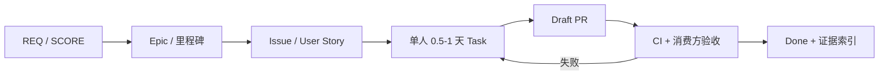

# XH-202607 项目管理执行指南

## 1. 管理目标

在 2026 年 9 月 2 日前形成可复现的“自然语言 → 语义任务分解 →
VLA 动作 → 仿真执行 → 重新观察/核验 → 恢复或切换”闭环，并在
9 月 3-5 日只做提交校验。项目以官方需求和可重复证据为准，不以工作时长或
口头完成度为准。

## 2. 单一事实源

| 层级 | 事实源 | 用途 |
|---|---|---|
| L0 | 两份官方 PDF | 唯二官方指标；任何人不得改写 |
| L1 | 两张冻结图 | 架构和 A-F 分工边界 |
| L2 | `official-requirements-baseline.md` | 需求/评分/提交物追踪 |
| L3 | `daily-plan.md` + Gate | 日期、范围和降级决策 |
| L4 | GitHub Issue/PR/CI/日志 | 每日实际进展 |
| L5 | 初版 DOCX、会议记录 | 可修改参考，不得覆盖 L0-L4 |

冲突从高到低裁决。未经 PR 记录的口头约定，不能改变接口、Gate 或 DoD。

## 3. 工作分解与流转

### Issue 最小字段

- 背景和对应 `REQ-* / SCORE-* / Gate`；
- owner、support、优先级和截止时间；
- 输入、输出路径、明确不做的范围；
- 可复制的验收命令和阈值；
- 依赖、风险、失败回退；
- 完成后的 PR、日志、报告或录像位置。

### Definition of Ready

任务进入当天计划前必须满足：

- owner 唯一、依赖 owner 已确认；
- 预计 0.5-1 天能产出可审查增量；
- 输入/输出字段、版本或数据身份明确；
- DoD 能由另一个人执行，而不是“看起来可以”。

### Definition of Done

- 代码/配置/文档已进 Draft PR 并关联 Issue；
- 自动测试、固定 seed 或人工审计按任务性质通过；
- 日志包含环境、代码/模型/数据 SHA 和失败样例；
- 消费方验证接口，F 验证证据，A 验证范围；
- 文档、代码和演示一致；限制与负结果未被隐藏。

## 4. 六人协作边界

| 角色 | 最终负责 | 必须验收谁 | 主要消费者 |
|---|---|---|---|
| A | 需求、TaskPlan/FSM、路由/恢复、总集成 | B/D/E/F 的统一合同 | 全员 |
| B | 仿真、机器人、控制、安全执行 | A 的动作合同、C 的资产 | A/D/E/F |
| C | 场景、任务生成、canonical 数据 | B/F 的回放与 QA | D/E/F |
| D | OpenVLA-OFT 复现/微调/服务 | A/B 的观察动作合同 | A/F |
| E | π0.5/openpi 复现/微调/服务 | A/B 的观察动作合同 | A/F |
| F | 核验、评测、CI、复现、报告/视频 | 全员交付证据 | A/评委 |

接口提供者和首个消费者必须共同签字。例如 D/E 的服务不能由作者自己单独判定
完成，至少需要 A 或 B 运行统一合同测试。

## 5. 每日节奏

| 时间 | 动作 | 输出 |
|---|---|---|
| 09:00 | A 按仓库证据发布 A-F 任务 | 每人一个主任务、DoD、依赖、截止 |
| 09:15 | 10 分钟同步 | 昨日事实、今日目标、阻塞；不做技术研讨 |
| 14:00 | 依赖检查 | P0/P1、交接物、是否启动回退 |
| 17:00 | owner 交付 | Draft PR、测试、日志、失败样例 |
| 18:00 | 集成门 | F 跑基线/CI，A 作接受、返工或降级决定 |
| 日终 | 看板更新 | Done/Partial/Blocked 与次日第一动作 |

技术讨论另开 25 分钟限时会议；必须以选择、owner、日期、退出条件结束。

## 6. Gate 与范围控制

- Gate 是决定点，不是汇报点。未达到阈值时当天执行预设降级。
- 任一新增功能必须写明替代/删除什么；D30 后不得增加模型家族或平台。
- 每名成员 WIP 上限为 1 个主任务；等待依赖时只能做预先列出的备份任务。
- 连续两天 `Partial` 等价于计划失效，A 必须拆小或降级，不能只移动日期。
- 优先保护：完整闭环、失败恢复、工业微调对照、复现和六项提交物。

## 7. 变更管理

### 可直接由 owner 决定

- 不改变接口和 Gate 的局部实现；
- 测试、日志和文档补强；
- 一天内可逆、不会影响他人的配置修正。

### 必须由 A 决定并在 PR/Issue 记录

- 统一 schema、动作坐标/单位、服务协议变化；
- 平台、模型主线、数据 split、成功阈值变化；
- Gate 日期/范围和角色责任变化；
- 冻结架构图的任何解释争议。

### 不允许的变更

- 修改或替换官方 PDF 内容；
- 弱化每步重观察、失败恢复、仿真初赛等硬要求；
- 使用 GT/坐标让 VLA 绕过视觉落地；
- 把 mock、接口、单次成功或作者机器运行宣称为完整实现。

## 8. 会议和沟通

- 每个技术结论必须落到 Issue/ADR/PR，不依赖聊天记录。
- 阻塞消息使用：`现象 + 复现命令 + 已尝试 + 需要谁在几点前决定`。
- 评审只评论范围、正确性、接口、测试、风险，不评价个人。
- P0 立即 @A/@F；P1 当日 14:00 前；P2 放入 backlog，不打断关键路径。

## 9. 度量与周报

每周只报告以下可验证数据：

- Gate 通过/未通过及实际证据；
- 三任务族成功率、失败码分布和置信区间；
- 仿真/模型 P50/P95、显存和稳定性；
- 数据有效率、回放一致率、split/泄漏审计；
- base vs fine-tuned、单/双模型、恢复策略消融；
- P0/P1 数量、关键路径偏差和下周降级决定；
- 六项官方提交物的 `No evidence / Partial / Reproducible` 状态。

不使用提交数量、代码行数或在线时长衡量成员产出。

## 10. 配套文件

- [官方需求基线](../requirements/official-requirements-baseline.md)
- [40 天逐日计划](daily-plan.md)
- [项目 WBS](wbs.md)
- [每日任务模板](daily-task-template.md)
- [每日任务自动化](daily-task-automation.md)
- [项目看板](dashboard.md)
- [风险登记册](risk-register.md)
- [GitHub 协作指南](github-collaboration-guide.md)
- [代码贡献规范](../../CONTRIBUTING.md)
