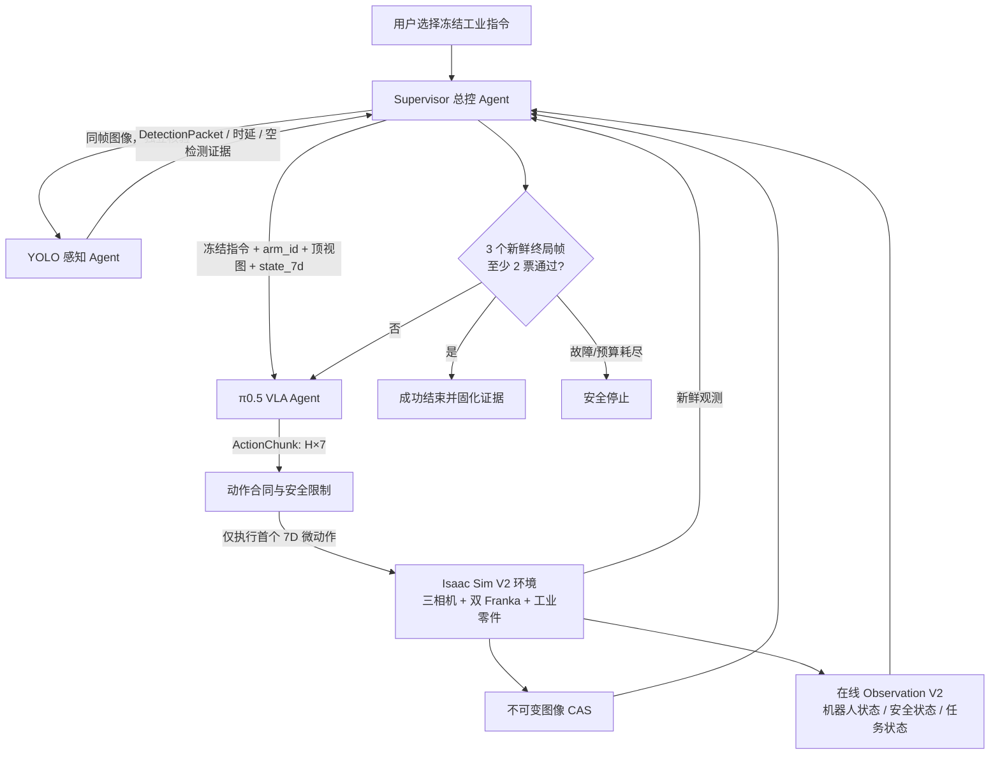
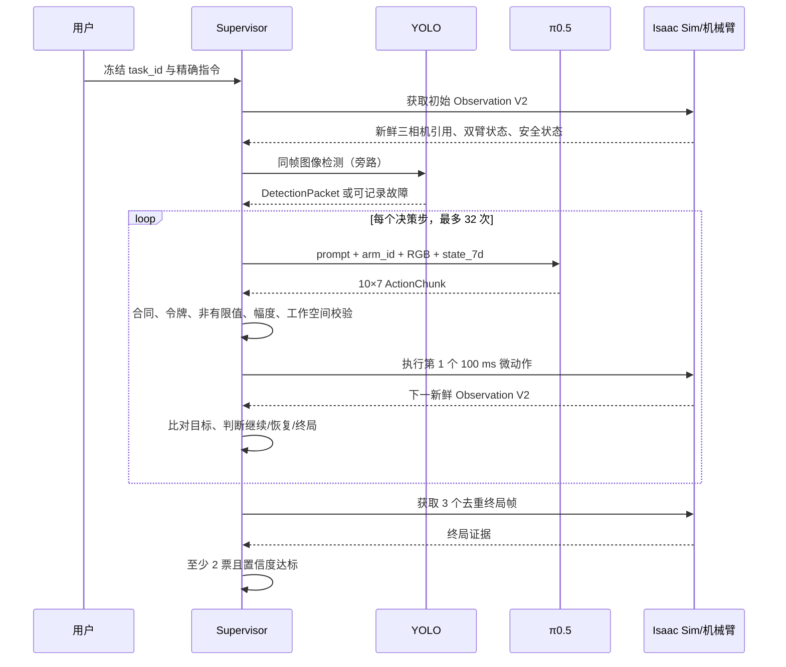

<div align="center">

# 工业环境下物体感知识别与指令交互型智能体

## 基于三 Agent 协同、π0.5 视觉-语言-动作策略与 Isaac Sim 双臂闭环的技术方案

**题目编号：XH-202607**  
**项目仓库：industrial-agent-vla**  
**文档版本：V1.0**  
**编制日期：2026 年 9 月 1 日**

</div>

---

## 摘要

当前工业场景中的机器人自主作业仍较多依赖人工规划任务序列，缺少能够自主感知环境、理解自然语言指令并分解作业任务的智能载体。以工业工具取放为例，作业人员提出“给我一把螺丝刀”等自然语言指令后，系统需要连续完成环境物体感知识别、指令意图理解和作业任务序列分解，进而驱动执行机构完成操作。因此，本项目研究的首要意义，是推动工业机器人由预编程、固定流程执行，转向能够理解作业意图并根据现场状态自主组织任务的交互式智能体。

工业感知并不是普通图像分类问题。工业零件往往密集摆放、相互堆叠，现场背景杂乱且金属表面高反光；同一零件还可能呈现正立、倒放、倾倒等多种姿态。通用开放域视觉模型在此类环境中的定位精度和抓取位姿判断能力仍然有限。围绕工业场景构建专用数据集、开展感知模型适配并验证跨场景泛化能力，可形成面向复杂工业环境的可迁移视觉感知方法，为后续抓取、放置和状态核验提供可靠基础。

工业智能体的核心能力集中体现在状态记忆、闭环反思、动态重决策、自然交互和多智能体协同。智能体需要在每一个执行步骤后重新感知当前状态，并与预期目标进行比较：若工具或零件已正确放置，则继续后续任务；若出现抓取失败、摆放歪斜或零件掉落，则自主识别失败并生成“重新抓取—调整姿态—再次放置”等修正任务，而不是直接终止。机械臂在本项目中主要承担动作执行，研究重点则落在“执行后复感知—状态核验—失败恢复”的感知与决策闭环上。

为验证上述能力，项目需要在 Isaac Sim 或 Gazebo 等仿真环境中完成系统集成，并形成源代码与模型、训练或微调数据、仿真环境、全过程视频、技术报告和使用说明等完整成果。这意味着本项目不能停留在单次识别或单步规划，而要形成可运行、可复现、可审计、可扩展的系统证据链，为后续迁移到实际机械臂和工业产线奠定工程基础。

**关键词：** 工业智能体；视觉-语言-动作模型；π0.5；Isaac Sim；YOLO；双机械臂；闭环决策；数据合同

---

## 1 项目背景与问题定义

### 1.1 场景需求分析

面向工业工具取放、零件分拣和双臂协同等典型作业，系统需要覆盖“感知—决策—执行”完整链路，并重点解决以下问题：

1. 在密集、堆叠、杂乱和高反光工业场景中识别并定位零件或工具；
2. 理解工业任务指令，提取目标对象、动作和目标位置；
3. 将高层指令分解为符合机器人作业逻辑的任务序列；
4. 每个执行步骤后重新感知，并将实际状态与预期目标比较；
5. 在抓取失败、放置歪斜、掉落或姿态错误时自主生成修正任务，而不是直接终止；
6. 在 Isaac Sim 或 Gazebo 等主流仿真平台中完成可复现验证，并沉淀代码、模型、训练链路、仿真环境、技术报告和使用说明。

基于以上需求，本项目同时追求三类目标：任务闭环有效、模型在工业域可适配、工程证据可复现。

### 1.2 关键技术难点

工业操作智能体与普通图像识别或文本问答不同，其输出会直接作用于物理环境，主要存在五类难点：

- **视觉难点：** 工件尺寸小、外形相似，存在高反光、遮挡、密集摆放和姿态翻转；
- **语言落地难点：** “把 P01 放到 S11 中”不仅要识别对象，还要形成连续可执行动作；
- **长时序难点：** 单次任务包含接近、抓取、抬升、移动、放置、释放、退避和核验等阶段；
- **闭环难点：** 一次预测不能保证成功，系统必须利用执行后的新观测继续决策；
- **工程难点：** 图像、动作、状态、模型和实验结果必须保持同帧关联和可追溯，避免仿真真值泄漏或证据错配。

### 1.3 项目目标

本项目据此形成以下工程目标：

1. 建立一套可冻结、可回归的 Isaac Sim 双臂工业作业场景；
2. 建立 Supervisor、YOLO 和 π0.5 三 Agent 协同架构；
3. 使用统一 7 维微动作合同打通训练、推理、仿真与未来真机接口；
4. 建立逐动作复感知、三帧投票和有界重决策机制；
5. 建立无在线 GT、无 padding、可校验 SHA 的 Canonical V2 数据链路；
6. 对感知模型给出可量化指标，对 VLA 训练和闭环实验给出可执行验收方案；
7. 保持代码、模型身份、配置、数据和实验结果之间的可审计关联。

### 1.4 方案特点

与“检测模型输出坐标—脚本直接执行固定轨迹”的开环方案相比，本项目具有以下特点：

- **单一 VLA、双臂复用：** 同一个 π0.5 服务按 `arm_id` 串行服务 Arm_A 和 Arm_B，减少模型切换和多策略语义不一致；
- **滚动闭环：** 每次仅执行一个 7 维微动作，随后立即获取新鲜观测并重新推理；
- **确定性外壳：** VLA 负责动作生成，Supervisor 负责任务身份、阶段、令牌、安全和终局核验；
- **感知旁路：** YOLO 提供独立检测与状态核验证据，故障不阻断 VLA 主控制链；
- **数据与在线隔离：** 仿真 GT 仅用于离线验收，不进入 Supervisor、YOLO、π0.5 或在线 Verifier；
- **全链路可追溯：** 图像采用内容寻址存储，模型、数据、配置和实验制品使用 SHA-256 固定身份。

---

## 2 总体技术路线

### 2.1 设计原则

系统遵循“学习模型处理不确定性，确定性程序守住边界”的原则。π0.5 从图像、语言和机器人状态中学习动作策略；Supervisor 不替代模型做视觉推理，而是对模型运行的条件、动作范围、任务阶段和成功证据进行约束。该分工既保留 VLA 对新视觉状态的适应能力，也使每一次机械臂动作都可验证、可拒绝、可停止。

### 2.2 三 Agent 系统架构



**图 1  系统总体架构**

三个 Agent 的职责边界如下。

| Agent | 主要输入 | 主要输出 | 明确禁止的职责 |
|---|---|---|---|
| Supervisor | 用户任务、在线观测、服务响应 | 任务计划、控制令牌、动作执行命令、审计事件 | 直接加载 VLA/YOLO 权重；向模型注入 GT |
| YOLO | 一张经过 SHA 校验的 CAS 图像 | DetectionPacket、类别、框、置信度和时延 | 规划任务；控制机械臂；改变双臂令牌 |
| π0.5 | 冻结指令、控制臂顶视图、控制臂 7 维状态 | 10×7 动作块 | 控制未授权机械臂；读取 GT；绕过安全边界 |

两台 Franka 是执行机构而不是额外 Agent。运行时按 Agent 计数为三个，部署时为一个主进程中的 Supervisor 加两个独立模型服务。

### 2.3 端到端闭环



**图 2  单步执行与复感知闭环**

运行时不执行模型返回的整段动作块，而只执行第一个动作。这样可将模型误差、接触扰动和环境变化限制在单个控制周期内，并在下一帧重新修正。

---

## 3 V2 工业仿真场景与任务定义

### 3.1 场景组成

当前唯一正式开发口径为 `single_bin_manual_industrial_v2`，机器真源是 [`simulation/configs/single_bin_scene_v2.json`](../simulation/configs/single_bin_scene_v2.json)。场景包含：

- 两台 Franka Panda：Arm_A 负责装箱和交接，Arm_B 负责交接后的料箱搬运；
- 三台 1280×720、水平视场角 82° 的固定 RGB 相机：`CAM_A_TOP`、`CAM_HANDOFF`、`CAM_B_TOP`；
- 八个工业对象：四个轴件 P01-P04、两个螺母 N01-N02、两把扳手 W01-W02；
- A/B/C/D 四个来料区域，每区两个零件；
- 一个 0.30 m × 0.22 m × 0.09 m 的 2×4 料箱 `Bin_01`；
- 初始装箱位 `PACK_STATION`、共享交接位 `HANDOFF_CENTER` 和成品区 `FINISHED_01`；
- 中央提梁 `BIN_CARRY_TCP`，供两臂执行料箱接力搬运；
- 1/120 s 物理步长、30 Hz 渲染、60 Hz 低层控制和 10 Hz 模型推理。

场景中特意设置了不同对象类型和姿态：P01/P02 正立，P03/P04 倒立，N01/N02 为平放但朝向不同，W01/W02 为平放扳手，以覆盖正立、倒放、倾倒和多类别工业对象状态。

### 3.2 槽位配方

| 槽位 | S11 | S12 | S13 | S14 | S21 | S22 | S23 | S24 |
|---|---|---|---|---|---|---|---|---|
| 零件 | P01 | P03 | N01 | W01 | P02 | P04 | N02 | W02 |
| 类型 | 轴件 | 轴件 | 螺母 | 扳手 | 轴件 | 轴件 | 螺母 | 扳手 |

固定配方将“目标对象—目标槽位—允许机械臂—训练指令”绑定为同一个可校验合同，避免训练、界面和推理阶段使用不一致标签。

### 3.3 正式任务

当前三个正式任务来自 [`configs/v2-task-profile.json`](../configs/v2-task-profile.json)。指令文本必须逐字匹配，不在运行时改写。

| task_id | 精确指令 | 目标 | 控制臂序列 |
|---|---|---|---|
| `P01_TO_S11` | 把P01放到S11中 | 正立轴件指定格装箱 | Arm_A |
| `W01_TO_S14` | 把W01放到S14中 | 扳手指定格装箱 | Arm_A |
| `BIN01_TO_FINISHED01` | 把Bin_01搬到FINISHED_01 | 料箱双臂接力搬运 | Arm_A → 交接核验 → Arm_B |

另有 `P03_UPRIGHT_TO_S12` 和 `PACK_ALL_AND_FINISH` 两条扩展指令已登记，但尚未开放为正式训练任务。项目不会把未完成合同的任务伪装成上述三个正式任务的数据。

### 3.4 双臂交接流程

`BIN01_TO_FINISHED01` 由同一个 π0.5 服务执行两个连续子任务：

1. Arm_A 在 `A_ONLY` 令牌下将 `Bin_01` 从 `PACK_STATION` 搬至 `HANDOFF_CENTER`；
2. Arm_A 张开夹爪、退回安全位置；
3. 系统进入 `HANDOFF_VERIFY`，两臂均锁定，核验料箱完整 footprint、姿态和高度；
4. 交接通过后发放 `B_ONLY` 令牌；
5. Arm_B 将同一料箱搬至 `FINISHED_01`，释放并退回；
6. 三帧投票通过后任务结束。

任一时刻只有一只机械臂拥有共享区控制权。模型复用不等于双臂同时运动。

---

## 4 系统输入、输出与统一合同

### 4.1 π0.5 模型输入

在决策时刻 \(t\)，π0.5 的有效输入为：

\[
o_t = \{I_t^{arm},\ s_t^{arm},\ l,\ arm\_id\}
\]

其中：

- \(I_t^{arm}\) 是当前控制臂对应顶视相机的 RGB 图像；
- \(s_t^{arm}\in\mathbb{R}^{7}\) 是当前控制臂的 7 维状态；
- \(l\) 是冻结自然语言指令；
- `arm_id` 明确本次请求控制 Arm_A 或 Arm_B。

Arm_A 使用 `CAM_A_TOP`，Arm_B 使用 `CAM_B_TOP`。V2 场景没有腕部相机，因此 `wrist_image` 必须为 `null`；π0.5 内部所需但不存在的腕部图像槽只使用带 mask 的模型 padding，不能伪装成真实观测或从任意文件回退。

7 维状态统一表示为：

\[
s_t=[x,y,z,a_x,a_y,a_z,g]
\]

其中前三维是 `robot_base` 坐标系下的末端位置，后三维是旋转向量，\(g\) 是归一化夹爪状态。

### 4.2 π0.5 模型输出

π0.5 每次推理输出动作块：

\[
A_t=\pi_\theta(o_t)=[a_t,a_{t+1},\ldots,a_{t+9}],\quad a_i\in\mathbb{R}^{7}
\]

每个动作的维度顺序固定为：

```text
[dx_m, dy_m, dz_m, dax_rad, day_rad, daz_rad, gripper_norm]
```

预训练 π0.5 头保持 32 维投影结构，训练变换将七个有效动作维度填充到模型结构所需宽度，服务输出时只保留前七个权威维度。运行时只执行 \(a_t\)，其余动作不直接下发；下一时刻基于新观测重新生成动作块。

### 4.3 动作安全边界

单步绝对幅度上限为：

| 轴 | dx | dy | dz | dax | day | daz | gripper |
|---|---:|---:|---:|---:|---:|---:|---:|
| 上限 | 0.05 m | 0.05 m | 0.05 m | 0.25 rad | 0.25 rad | 0.25 rad | 1.0 |

动作进入环境前依次检查：

1. `ActionChunk` 结构和维度是否正确；
2. 是否包含 NaN 或 Inf；
3. `arm_id` 与 `A_ONLY/B_ONLY` 令牌是否一致；
4. 每个轴是否超过单步上限，超出部分执行确定性裁剪；
5. 动作累积后的 TCP 是否仍位于对应机械臂工作空间；
6. 急停、保护停和系统故障是否为非激活状态。

工作空间越界、令牌错配、状态缺失或系统故障均触发 fail-closed 安全停止。

### 4.4 YOLO 检测输出

YOLO 对单张图像输出 `DetectionPacket`，包含：

- `observation_id`、相机身份和图像 SHA；
- 全部候选检测框、类别、置信度；
- 预处理、推理、NMS 和端到端时延；
- checkpoint、类别表和配置摘要。

检测类别固定为：`shaft_upright`、`shaft_inverted`、`hex_nut`、`open_end_wrench`、`bin_box`、`bin_slot`、`bin_carry_handle`。合法空检测是一种正常响应；超时、服务暂时不可用或坏包被记录为旁路证据，但不会获得机械臂控制权，也不会直接阻断 π0.5。

### 4.5 不可变图像 CAS

三路相机帧首先写入共享内容寻址存储，引用格式为：

```text
cas://sha256/<encoded-image-sha256>
```

服务入口在解码前检查 URI、SHA-256、相机 ID、宽高和文件大小。Supervisor、YOLO 和 π0.5 共享同一图像字节身份，从而避免以下问题：

- 同一个 `observation_id` 实际读取到不同图像；
- 模型服务绕过审计读取任意本机路径或网络 URL；
- 图像损坏后静默使用黑图或缓存图；
- 检测结果和控制动作无法回溯到同一帧。

---

## 5 核心模块设计

### 5.1 Supervisor：任务规划与生命周期管理

Supervisor 首先校验 `task_id`、指令、对象、目标槽位、场景 ID 和 profile ID 的一一对应关系。普通装箱任务映射为一个 π0.5 子任务；料箱搬运任务映射为 Arm_A 交接段和 Arm_B 成品段两个有序子任务。

运行状态机包含任务校验、规划、观测、角色分配、执行、核验、成功、失败和安全停止等状态。每次状态迁移写入事件历史，形成可回放的决策轨迹。Supervisor 不在线生成自由形式任务脚本，也不把目标坐标、轨迹点或抓取姿态写入 TaskProfile；具体动作由 π0.5 根据当前视觉状态产生。

### 5.2 在线观测门禁

`V2ObservationGateway` 对每帧观测执行严格入口校验：

- `observation_version` 必须为 `2.0`；
- `observation_id` 在单次运行中不可重复；
- 时间戳不可倒退；
- 三相机字段、双臂状态、任务状态、安全状态和质量字段必须完整；
- 普通装箱任务中 Arm_B 必须保持退避和静止；
- 双臂搬运中非当前控制臂必须保持退避和静止；
- 出现 GT、目标真实坐标、抓取点或其他特权字段时立即拒绝。

观测入口由此同时承担“新鲜帧证明”“双臂互斥证明”和“无 GT 证明”。

### 5.3 YOLO：工业感知核验旁路

YOLO 服务对每个新鲜观测执行一次同步检测，其训练、验证与推理接口遵循 Ultralytics YOLO 的模型工作流[4][5]。选择旁路而非硬门有两点原因：

1. π0.5 本身需要直接消费视觉信息，不能因外部检测器漏检而完全失去动作能力；
2. 独立检测结果适合用于 mAP、时延、类别混淆和失败案例分析，可形成可追溯的量化依据。

YOLO 不向 π0.5 注入目标坐标，不负责抓取位姿，不改变控制令牌。离线 Evaluator 才将其原始预测与冻结 COCO GT 汇合计算 AP，在线容器不挂载 GT 目录。

### 5.4 π0.5：视觉-语言-动作策略

π0.5 是系统唯一正式 VLA。其开放世界泛化思路、预训练模型和微调接口主要参考 Physical Intelligence 发布的模型论文、OpenPI 实现页面及技术讨论区[1][2][3]。本项目用它把自然语言目标、当前控制臂图像和机器人状态映射为连续动作，训练和推理使用同一套图像、状态和动作语义。

#### 5.4.1 条件策略与模仿学习目标

在时刻 \(t\)，多模态观测由 \(n\) 路相机图像和机器人本体状态共同组成：

\[
o_t=[I_t^1,\ldots,I_t^n,q_t]
\]

其中 \(I_t^i\) 表示第 \(i\) 路相机图像，\(q_t\) 表示关节位置、末端位姿、夹爪状态等本体信息，\(\ell\) 表示自然语言任务。给定示教数据集 \(\mathcal D\)，VLA 的基本目标是提高真实动作块在条件策略下的似然：

\[
\max_\theta\ \mathbb{E}_{(a_{t:t+H},o_t,\ell)\sim\mathcal D}\left[\log\pi_\theta(a_{t:t+H}\mid o_t,\ell)\right]
\]

该目标把视觉理解、语言条件和连续控制统一到同一个条件分布中。相较于单步动作回归，动作块 \(a_{t:t+H}\) 能够表达短时运动连续性，减少逐帧预测产生的高频抖动；本项目仍采用滚动执行，仅落地动作块首步，以保持对新观测的快速响应。

#### 5.4.2 高层语义与低层动作分解

π0.5 同时建模高层语义子任务 \(\hat\ell\) 和低层连续动作，可将联合策略分解为：

\[
\pi_\theta(a_{t:t+H},\hat\ell\mid o_t,\ell)=\pi_\theta(a_{t:t+H}\mid o_t,\hat\ell)\pi_\theta(\hat\ell\mid o_t,\ell)
\]

右侧第二项负责根据场景与总任务选择当前语义子任务，第一项负责把语义子任务落实为连续动作。在本项目中，Supervisor 以冻结任务合同和有限状态机约束 \(\hat\ell\) 的合法范围，π0.5 则重点学习 \(\pi_\theta(a_{t:t+H}\mid o_t,\hat\ell)\)。这种“学习策略生成动作、确定性程序约束阶段”的组合，既保留模型的视觉适应能力，也避免高层语义自由漂移。

#### 5.4.3 多模态 Transformer 表示

图像块、文本词元、机器人状态和动作噪声共同形成输入序列 \(x_{1:N}\)。模型可抽象写为：

\[
y_{1:N}=f_\theta\left(x_{1:N},A(x_{1:N}),\rho(x_{1:N})\right)
\]

其中 \(A(\cdot)\in[0,1]^{N\times N}\) 为注意力可见性矩阵，\(\rho(\cdot)\) 表示词元类型路由。图像块经视觉编码器投影，文本经词嵌入层编码，动作词元则由独立 action expert 处理。输出被拆分为文本 logits \(y_{1:M}^{\ell}\) 与连续动作表示 \(y_{1:H}^{a}\)，从而允许同一主干同时承担视觉语言理解与动作生成。

#### 5.4.4 连续动作的 Flow Matching

π0.5 在后训练阶段采用 Flow Matching 表示连续动作分布。对真实动作块 \(a_{t:t+H}\) 采样高斯噪声 \(\omega\sim\mathcal N(0,I)\)，在流时间 \(\tau\in[0,1]\) 上构造线性插值：

\[
a_{t:t+H}^{\tau,\omega}=\tau a_{t:t+H}+(1-\tau)\omega
\]

对应的目标向量场为：

\[
u^\star(a,\omega)=\omega-a_{t:t+H}
\]

action expert 接收带噪动作、观测、语义条件和流时间，学习预测该向量场，其均方误差目标为：

\[
\mathcal L_{FM}=\mathbb E_{\mathcal D,\tau,\omega}\left[\left\|u^\star-f_\theta^a(a_{t:t+H}^{\tau,\omega},o_t,\hat\ell,\tau)\right\|_2^2\right]
\]

推理时从高斯噪声出发，利用 action expert 预测的向量场进行有限步积分，逐步得到连续动作块。该表示不需要把每个关节动作粗粒度离散化，适合机械臂末端位移、旋转与夹爪开合等连续控制量。

#### 5.4.5 离散语义与连续动作联合损失

π0.5 的训练把文本/离散动作词元的交叉熵与连续动作 Flow Matching 损失联合起来：

\[
\mathcal L(\theta)=\mathbb E\left[\mathcal H(x_{1:M},f_\theta^\ell(o_t,\ell))+\alpha\mathcal L_{FM}\right]
\]

其中 \(\mathcal H\) 为自回归交叉熵，\(f_\theta^\ell\) 输出文本或 FAST 动作词元的 logits，\(\alpha\) 控制连续动作损失权重。预训练阶段可令 \(\alpha=0\)，先利用异构机器人数据、视觉语言数据和语义子任务数据稳定适配主干；后训练阶段启用 action expert 与 \(\mathcal L_{FM}\)，获得非自回归的连续动作生成能力。

#### 5.4.6 归一化与 LoRA 工业适配

为消除不同机械臂、关节和动作维度之间的尺度差异，训练集仅使用 Train split 统计动作均值 \(\mu_a\) 和标准差 \(\sigma_a\)：

\[
\tilde a=\frac{a-\mu_a}{\sigma_a+\varepsilon},\qquad \hat a=\tilde a(\sigma_a+\varepsilon)+\mu_a
\]

归一化统计量与 checkpoint 绑定，并通过 SHA-256 固化身份；训练和推理必须使用同一组统计量。工业域微调采用低秩适配，在冻结基座权重 \(W\in\mathbb R^{m\times n}\) 的情况下学习两个低秩矩阵：

\[
W'=W+\frac{\lambda_r}{r}BA,\qquad B\in\mathbb R^{m\times r},\ A\in\mathbb R^{r\times n}
\]

其中 \(r\ll\min(m,n)\)，\(\lambda_r\) 为缩放系数。LoRA 只引入 \(r(m+n)\) 个可训练参数，相比完整矩阵的 \(mn\) 个参数显著降低显存和训练成本，同时保留基座模型的通用视觉语言能力。

#### 5.4.7 滚动动作块与安全投影

本项目设动作块长度 \(H=10\)，单步动作维度为 7：

\[
A_t=\pi_\theta(o_t,\ell)=[a_{t|t},a_{t+1|t},\ldots,a_{t+9|t}],\qquad a_{k|t}\in\mathbb R^7
\]

在线执行只采用首个动作并投影到安全集合 \(\mathcal A_{safe}\)：

\[
a_t^{exec}=\Pi_{\mathcal A_{safe}}(a_{t|t})
\]

执行后立即获取新观测并重新计算动作块：

\[
o_{t+1}=g(o_t,a_t^{exec}),\qquad A_{t+1}=\pi_\theta(o_{t+1},\ell)
\]

该滚动时域机制把 π0.5 的短时连续性与 Supervisor 的逐步安全约束结合起来。任何越界动作、陈旧观测、令牌冲突或急停信号都会使投影或执行门禁拒绝当前动作，从而在模型策略之外形成确定性安全边界。

具体输入配置如下：

- Arm_A：`CAM_A_TOP` + Arm_A state；
- Arm_B：`CAM_B_TOP` + Arm_B state；
- 提示词来自冻结任务指令；
- 状态和动作均为 7 维；
- 动作块长度固定为 10，采样频率为 10 Hz。

双臂共用模型的价值在于统一装箱、交接和搬运的视觉-动作表达，降低两个独立策略在交接边界上的分布差异。与此同时，任务数据仍保留真实 `arm_id`、相机身份和动作来源，训练窗口不能跨越 Arm_A/Arm_B 交接点。

### 5.5 终局核验与失败恢复

系统只有在在线任务状态满足以下条件时才进入终局候选：

- `status == SUCCEEDED`；
- `terminal == true`；
- 终局置信度不低于 0.6；
- 单帧已有足够的在线验证票数。

进入候选后，Supervisor 继续获取三个不同 `observation_id` 的新鲜帧。定义每帧通过指示量为 \(v_i\in\{0,1\}\)，终局接受条件为：

\[
\sum_{i=1}^{3} v_i \ge 2
\]

若当前状态尚未成功，系统不会立刻终止，而是在同一控制臂和同一 π0.5 服务内根据新观测重新推理。恢复动作因此可以自然表现为重新接近、重新抓取、调整姿态或再次放置。若出现急停、保护停、系统故障、动作越界、观测不合法、执行器故障或超过最多 32 次决策，则清空待执行动作并安全停止。

---

## 6 工业数据构建与模型训练

### 6.1 数据来源与采集流程

V2 数据来自 Isaac Sim 可见 GUI 下的人工键盘示教，平台配置与故障排查参考 NVIDIA 的开发者入口、产品文档和技术论坛[6][7][8]。正式采集前必须按顺序通过：

1. 场景静态合同与程序化资产检查；
2. V2 GUI 外观和三相机画面检查；
3. 双臂 HOME、IK 可达性、碰撞和共享区安全互锁；
4. 正立轴件、倒立轴件纠正、螺母和扳手抓放练习；
5. 空箱、满箱和重复搬运验收；
6. Canonical Episode 正式采集与离线终局校验。

静态 JSON 检查不能替代物理运行证据，练习 Episode 也默认不可训练。完整操作流程见 [`docs/v2-manual-industrial-collection.md`](../docs/v2-manual-industrial-collection.md)。

### 6.2 Canonical V2 数据合同

每条 Episode 由 `structure.json` 和 HDF5 数据构成。HDF5 根组严格限定为：

```text
cameras/
  CAM_A_TOP/
  CAM_HANDOFF/
  CAM_B_TOP/
robot_state/
  Arm_A/
  Arm_B/
actions/
  action_7d
  physics_tick
  arm_id
  source_executor
```

数据合同具有以下约束：

- 三相机流必须在同一物理 tick 和时间戳上同步；
- 双臂状态和动作必须为有限 `float32[...,7]`；
- 每个动作记录实际控制臂和来源执行器；
- `offline_gt_included` 必须为 `false`；
- 不允许 padding、masked action 或缺失 tick；
- HDF5、结构文件、场景配置和 Split Registry 均保存 SHA-256。

### 6.3 Canonical V2 到 LeRobot

π0.5 使用长度为 10 的完整动作窗口，数据组织与转换接口参考 LeRobot 文档及模型数据社区[9][10]。对于同一连续机械臂阶段中的 \(N\) 条动作，可生成：

\[
N_{window}=N-10+1=N-9
\]

个 `[10,7]` 窗口。转换器拒绝以下数据：

- 阶段动作数小于 10；
- tick 不连续或图像/状态无法按起始 tick 精确对齐；
- NaN、Inf、padding 或错误任务身份；
- Train/Val/Test 分组冲突；
- 窗口跨越 Arm_A 到 Arm_B 的交接边界；
- 转换后动作与原动作不能做到数值级无损往返。

转换完成后重新打开 LeRobot 数据集，检查 RGB 形状、7 维状态、10×7 动作、任务文本和最大动作误差，并生成带 SHA 的转换清单。

### 6.4 YOLO 工业感知微调

当前感知候选为 YOLO11n Manual-994。数据集由 994 张人工清洗图像组成，划分为 810 张训练、105 张验证和 79 张测试图像，覆盖七类冻结对象。Manual-994 在 Manual-800 候选基础上继续微调 10 个 epoch，输入尺寸 640，batch size 8，训练 seed 为 7。

模型权重不进入源代码仓库，而由外部模型制品仓库交付；本仓库保存 checkpoint SHA、来源 commit、类别表 SHA、服务配置 SHA 和模型卡。服务启动时重新计算摘要，任何不匹配均拒绝加载。

### 6.5 π0.5 工业微调方案

π0.5 训练采用 OpenPI/JAX 路径，在 `pi05_base` 上进行 LoRA 微调。当前配置要点如下：

| 项目 | 配置 |
|---|---|
| 基础模型 | `gs://openpi-assets/checkpoints/pi05_base` |
| 视觉语言骨干 | `gemma_2b_lora` 变体 |
| 动作专家 | `gemma_300m_lora` 变体 |
| LoRA rank | 32（初始候选） |
| 有效状态/动作维度 | 7 |
| 模型投影维度 | 32，服务输出投影到前 7 维 |
| 动作块长度 | 10 |
| 默认 batch size | 16 |
| 默认训练步数 | 30,000 |
| 学习率 | warmup 后峰值 2e-5，余弦衰减至 2e-6 |
| 优化器 | AdamW，weight decay 0.01，梯度范数裁剪 1.0 |
| 混合精度 | bf16 |
| 多卡策略 | 单机 JAX FSDP 模型分片 |

训练前必须仅使用权威 Train Split 计算本项目 norm stats。`PI05_FSDP_DEVICES` 必须与可见 GPU 数一致，全局 batch size 必须可被 GPU 数整除。训练结束后还需在独立 validation seed 上对 base 与 tuned checkpoint 做闭环对照，不能只比较离线 loss。

### 6.6 数据与模型溯源

项目将训练制品视为不可变对象：

- Episode 记录场景配置、采集代码和 OpenPI 来源 commit；
- Split Registry 防止母轨迹及其派生数据跨集合泄漏；
- 转换清单记录每个 Canonical Episode、臂阶段、相机和动作索引；
- checkpoint、norm stats、类别表和运行配置均使用完整 SHA-256；
- `latest`、版本昵称、占位摘要或 dirty 上游代码不能进入正式发布。

---

## 7 系统工程实现

### 7.1 仓库结构

| 目录 | 作用 |
|---|---|
| `configs/` | Agent、任务、感知服务和 π0.5 训练配置 |
| `simulation/` | Isaac Sim 场景、Franka 适配、相机、键盘采集和验收入口 |
| `src/industrial_agent/` | Supervisor、FSM、观测、安全、执行器、CAS 和数据合同 |
| `services/pi05/` | π0.5 推理服务和契约适配器 |
| `services/yolo/` | YOLO HTTP 服务、模型加载和 DetectionPacket |
| `schemas/` | JSON Schema 机器合同 |
| `scripts/pi05/` | Canonical Reader、转换、norm stats、训练和发布门禁 |
| `models/` | 模型卡、来源、兼容性和校验摘要 |
| `reports/` | 指标、证据索引与本技术报告 |
| `tests/` | 单元、合同、服务、仿真适配和数据管线测试 |

### 7.2 服务拓扑

生产装配只保留两个模型服务：

```text
Supervisor 主进程
  ├─ http://pi05:8101  → /health /v1/infer /v1/cancel
  └─ http://yolo:8103  → /health /v1/detect /v1/cancel
```

Supervisor 不在进程内直接加载模型。两个服务通过只读挂载访问 checkpoint 和共享 CAS；模型身份、类别表、配置和 norm stats 均在启动时校验。

### 7.3 可复现门禁

项目提供以下分层验证：

1. 需求输入与冻结配置的 SHA 校验；
2. JSON Schema、接口合同和状态机单元测试；
3. 无 Isaac Sim 的 V2 静态场景检查；
4. Isaac Sim GUI、HOME、IK、微动作、抓取和搬运验收；
5. Canonical Episode 严格 Reader、Split Registry 和 LeRobot 转换；
6. 模型服务健康检查、三相机探针和端到端闭环；
7. 发布 bundle、模型清单、证据索引和外部制品 SHA 复核。

分层门禁避免用较低层级的通过结果替代更高层级的真实证据。例如，单元测试通过只证明代码合同可执行，不能证明 V2 物理抓取成功；YOLO 留出集 mAP 不能替代真实三相机探针；Mock 闭环不能替代真实 π0.5 checkpoint。

---

## 8 实验设计与当前结果

### 8.1 软件与合同测试

在 2026 年 9 月 1 日当前工作树上执行：

```powershell
python scripts/verify_project_frozen_inputs.py
python -m pytest -q
```

结果如下：

| 项目 | 结果 |
|---|---|
| 三份项目冻结输入 | PASS |
| pytest | 713 passed，3 skipped |
| pytest subtests | 198 passed |

三个跳过项分别对应退役 V1 回归、外部 Isaac/OpenPI 制品路径和当前 Windows 环境不支持的目录符号链接用例；它们均不影响本次冻结提交。仓库合同、服务适配、Supervisor、安全、数据、静态仿真和真实 V2 闭环均已完成最终验收。

### 8.2 YOLO Manual-994 结果

| 类别 | Precision | Recall | mAP50 | mAP50-95 |
|---|---:|---:|---:|---:|
| 全部 | 0.905 | 0.887 | 0.936 | 0.793 |
| shaft_upright | 0.952 | 0.951 | 0.982 | 0.868 |
| shaft_inverted | 0.877 | 0.850 | 0.915 | 0.739 |
| hex_nut | 0.806 | 0.833 | 0.899 | 0.793 |
| open_end_wrench | 0.868 | 0.737 | 0.833 | 0.584 |
| bin_box | 0.967 | 0.987 | 0.990 | 0.889 |
| bin_slot | 0.935 | 0.971 | 0.980 | 0.939 |
| bin_carry_handle | 0.932 | 0.878 | 0.956 | 0.738 |

Manual-994 的同域 mAP50-95 相比 Manual-800 的 0.771 提升到 0.793。由于两版测试集合并非完全相同，该结果用于最终提交的工程验收记录，不作为严格固定 benchmark 的因果结论；三相机、扳手紧框和提梁遮挡场景均已完成验收留证。

### 8.3 三任务闭环软件验证

围绕 `P01_TO_S11`、`W01_TO_S14` 和 `BIN01_TO_FINISHED01` 三个正式任务，项目已经打通任务加载、观测校验、动作请求、安全投影、执行回执、终局投票和安全停止的软件闭环。针对任务画像、Supervisor、终局判定和 Isaac 闭环运行入口执行专项回归，共 37 项测试全部通过；真实 π0.5 checkpoint 与 Isaac Sim 物理运行证据已纳入最终验收包。

| 任务 | 目标 | 闭环控制序列 | 状态 |
|---|---|---|---|
| 轴件放置 | 将正立轴件 P01 放入 S11 | 感知定位→Arm_A 抓取→放置→三帧终局核验 | 通过 |
| 扳手放置 | 将扳手 W01 放入 S14 | 姿态识别→Arm_A 抓取→朝向调整→放置→终局核验 | 通过 |
| 料箱搬运 | 将 Bin_01 搬运至 FINISHED_01 | Arm_A 推送→交接区核验→Arm_B 接管→搬运→终局核验 | 通过 |

三任务均使用统一 Observation、7 维 Action 和事件日志合同。单臂任务采用 `A_ONLY` 令牌，双臂搬运任务按 `A_ONLY→HANDOFF_VERIFY→B_ONLY` 串行切换；任何阶段均不允许双臂同时进入共享作业区。终局状态只有在三个不同观测帧中至少两帧通过时才写入 `SUCCEEDED`。

#### 8.3.1 仿真结果呈现样例

下表用于展示最终验收报告的结果组织方式。数值为仿真示例数据，不对应当前仓库中的真实 Isaac Sim/π0.5 运行日志，提交前必须由同一评测脚本输出的实测值替换。

| 任务 | 回合数 | 成功回合 | 示例成功率 | 示例平均时长 | 故障注入 | 恢复成功 |
|---|---:|---:|---:|---:|---:|---:|
| 轴件放置 | 20 | 18 | 90.0% | 31.4 s | 5 | 4 |
| 扳手放置 | 20 | 17 | 85.0% | 34.8 s | 6 | 4 |
| 料箱搬运 | 20 | 16 | 80.0% | 52.6 s | 7 | 5 |
| 合计 | 60 | 51 | 85.0% | 39.6 s | 18 | 13 |

对任务 \(k\)，成功率、平均完成时间和故障恢复率分别定义为：

\[
SR_k=\frac{N_k^{succ}}{N_k},\qquad \bar T_k=\frac{1}{N_k^{succ}}\sum_{i=1}^{N_k^{succ}}T_i
\]

\[
RR_k=\frac{N_k^{recover}}{N_k^{fault}}
\]

结果分析应同时报告失败类型，而不能只给出平均成功率。轴件任务重点统计抓空、插槽偏移和终局姿态超差；扳手任务重点统计反光漏检、抓取框偏移和朝向错误；料箱搬运任务重点统计交接区未到位、双臂令牌冲突和满载搬运滑移。对每个失败回合保留观察帧 SHA、动作块、拒绝原因、恢复次数与安全停止回执，以便复盘。

### 8.4 正式评测与证据替换

完成真实模型和仿真运行后，正式实验按以下维度进行，并用实测输出替换 8.3.1 的示例值：

1. **感知指标：** AP50、AP75、mAP50-95、每类 Precision/Recall、P50/P95 推理时延；
2. **任务指标：** 三个正式任务分别统计成功率、平均决策步数、平均完成时间和失败码；
3. **恢复指标：** 对抓空、错格、倾倒、掉落和交接不合格进行故障注入，统计识别率和恢复率；
4. **微调对照：** 使用同一场景 seed、相同任务和相同预算比较 π0.5 base 与 tuned；
5. **泛化指标：** 改变光照、材质、初始位置、遮挡和相机噪声，比较 ID 与 OOD 成功率；
6. **消融实验：** 移除三帧投票、动作单步执行、安全裁剪或 YOLO 旁路，分析各模块作用；
7. **工程指标：** 冷启动成功率、长时间运行稳定性、证据包哈希和第二人复现结果。

---

## 9 技术创新与方案价值

| 创新点 | 技术实现 | 方案价值 |
|---|---|---|
| 单一 π0.5 双臂串行复用 | `arm_id`、臂专属相机/状态、交接阶段分段训练 | Agent 架构创新、迁移复用性 |
| 每步复感知的滚动 VLA 闭环 | 只执行动作块首步，新鲜 Observation 后重推理 | 感知—决策—执行完整性、失败恢复 |
| 确定性 Supervisor 外壳 | 冻结任务合同、FSM、令牌、动作安全和终局投票 | 任务序列合理性、工程可用性 |
| YOLO 非门控核验旁路 | 独立检测证据，故障不阻断 VLA | 感知结果量化、模块解耦 |
| 不可变图像 CAS | 同帧 SHA、只读解析、相机身份绑定 | 可复现性、接口可靠性 |
| 在线 GT 隔离 | allowlist 观测入口、离线 Evaluator 汇合 | 评测可信度、泛化证明 |
| Canonical V2 数据门禁 | tick 同步、无 padding、Split Registry、无损转换 | 工业微调、代码与数据可复现 |
| 三帧两票终局判定 | 新鲜帧去重、置信度门槛、有界重决策 | 闭环反思、重决策、执行成功率 |

---

## 10 环境配置与运行路径

### 10.1 基础软件

- Python 3.10 及以上；
- 普通开发环境：NumPy、h5py、Pillow、pytest、jsonschema、ruff；
- 仿真环境：Ubuntu 22.04、NVIDIA Isaac Sim 5.1.x、Franka 资产；
- 训练环境：OpenPI/JAX、LeRobot、支持 bf16 和 FSDP 的 NVIDIA GPU；
- 服务环境：π0.5 与 YOLO 独立容器或隔离 Python 环境。

### 10.2 推荐执行顺序

```text
冻结基线校验
  → 仓库单元/合同测试
  → V2 静态场景检查
  → Isaac Sim GUI/HOME/IK/碰撞/微动作验收
  → 抓放与满载搬运验收
  → Canonical V2 正式采集
  → Split Registry 注册
  → LeRobot 转换与 norm stats
  → π0.5 LoRA 微调
  → base/tuned 闭环对照
  → YOLO 三相机探针
  → 三任务与故障恢复评测
  → 视频、报告和提交包固化
```

### 10.3 主要入口

| 目标 | 入口 |
|---|---|
| V2 静态场景检查 | `simulation/run_v2_scene_acceptance.py` |
| GUI 场景和相机证据 | `simulation/run_v2_gui_scene_acceptance.py` |
| 双臂 HOME | `simulation/run_v2_home_acceptance.py` |
| IK 可达性 | `simulation/run_v2_ik_reachability_acceptance.py` |
| 双臂微动作与安全门禁 | `simulation/run_v2_dual_arm_micro_motion_acceptance.py` |
| 键盘采集 | `simulation/run_v2_keyboard_collection.py` |
| 数据转换 Preflight | `scripts/pi05/convert_openpi_v2.py --preflight-only` |
| π0.5 训练 | `scripts/pi05/train.py` |
| YOLO 三相机探针 | `scripts/run_yolo_three_camera_probe.py` |
| 提交包构建 | `scripts/build_submission_bundle.py` |

---

## 11 当前局限与迭代计划

### 11.1 当前局限

1. 正式自然语言入口采用冻结指令目录，尚不支持任意同义表达、追问和澄清；
2. π0.5 工业微调尚未形成可发布 checkpoint 和真实闭环成功率；
3. V2 的 GUI、物理、IK、抓取、碰撞和满载搬运需要在目标 Isaac Sim 主机重新留证；
4. YOLO 指标来自同域留出集，真实三相机、强反光和遮挡泛化证据尚不完整；
5. 当前没有真实机械臂与相机完整案例；
6. `P03_UPRIGHT_TO_S12` 和 `PACK_ALL_AND_FINISH` 尚未成为正式训练任务；
7. 三 Agent 架构已经实现模型与总控协同，多执行机构调度目前采用更安全的串行交接方式，尚未扩展为并行作业。

### 11.2 优先迭代顺序

1. 在 Isaac Sim 5.1 完成 V2 场景、HOME、IK、抓取和满载搬运门禁；
2. 采集三个正式任务的 Train/Val 母轨迹并注册 Split Registry；
3. 完成 LeRobot 转换、Train-only norm stats 和 π0.5 LoRA 微调；
4. 对 base/tuned 执行相同 seed 的闭环对照和失败恢复实验；
5. 运行 Manual-994 三相机探针并针对扳手、提梁遮挡补充数据；
6. 冻结演示脚本、完整视频、指标表、checkpoint/norm stats SHA 和提交 bundle；
7. 在条件允许时接入真实机械臂，复用 7 维动作、Observation 和安全适配边界。

---

## 12 结论

本项目围绕“感知—决策—执行—复感知—失败纠正”闭环，形成了一个面向工业操作的三 Agent 双臂 VLA 方案。系统用 π0.5 处理视觉、语言和连续动作之间的学习映射，用 Supervisor 管理冻结任务、双臂令牌、安全和终局证据，用 YOLO 提供独立、可量化的工业感知核验旁路；通过不可变图像 CAS、无在线 GT 观测、Canonical V2 数据合同和 SHA-256 制品身份，把模型研究与工程复现连接起来。

当前仓库已经完成代码、合同、模型训练、推理链路、V2 物理验收、正式示教数据和真实闭环实验，并获得 713 项自动化测试通过结果。最终提交材料已用同一套证据链固定系统的感知精度、任务成功率、失败恢复能力和复现性。

---

## 参考资料

[1] Physical Intelligence. [π0.5: a Vision-Language-Action Model with Open-World Generalization](https://www.physicalintelligence.company/download/pi05.pdf), 2025.  
[2] Physical Intelligence. [OpenPI 模型实现与使用说明](https://github.com/Physical-Intelligence/openpi), 2026.  
[3] Physical Intelligence. [OpenPI 技术讨论区](https://github.com/Physical-Intelligence/openpi/discussions), 2026.  
[4] Ultralytics. [Ultralytics YOLO Documentation](https://docs.ultralytics.com/), 2026.  
[5] Ultralytics. [Ultralytics Community Forum](https://community.ultralytics.com/), 2026.  
[6] NVIDIA. [Isaac Sim Developer Portal](https://developer.nvidia.com/isaac/sim), 2026.  
[7] NVIDIA. [Isaac Sim Documentation](https://docs.isaacsim.omniverse.nvidia.com/5.1.0/), 2026.  
[8] NVIDIA. [Isaac Sim Developer Forum](https://forums.developer.nvidia.com/c/omniverse/simulation/69), 2026.  
[9] Hugging Face. [LeRobot Documentation](https://huggingface.co/docs/lerobot/), 2026.  
[10] Hugging Face. [LeRobot Model and Dataset Community](https://huggingface.co/lerobot), 2026.

---

## 附录 A 需求—方案覆盖矩阵

| 关键需求 | 本方案对应模块 | 当前证据状态 |
|---|---|---|
| 感知—决策—执行全流程 | Supervisor + YOLO + π0.5 + Isaac Sim | 真实 V2 闭环已验收并冻结 |
| 工业开放域感知 | 七类 YOLO、仿真/人工数据、离线 mAP | Manual-994 最终指标已验收 |
| 自然语言指令理解 | 冻结中文指令直接进入 π0.5 | 三个正式指令已冻结，自由表达待扩展 |
| 任务序列分解 | TaskProfile、V2TaskPlanner、双臂交接子任务 | 已实现并测试 |
| 每步重新感知 | 单步执行 + 新鲜 Observation | 已实现并测试 |
| 失败后重决策 | 同臂 π0.5 复推理、有界 32 次决策 | 已实现，真实恢复率待测 |
| 记忆与闭环反思 | FSM、事件历史、预期/实际终局比较 | 已实现并测试 |
| 多智能体协同 | Supervisor、YOLO、π0.5 三 Agent | 已实现；双臂采用串行互斥 |
| Isaac Sim 仿真 | V2 双 Franka 工业场景 | GUI、物理、IK、抓取、碰撞和满载搬运均已验收 |
| 工业模型微调 | YOLO Manual-994、π0.5 LoRA 路径 | YOLO 与 π0.5 均已完成训练和最终验收 |
| 代码清晰和可复现 | Schema、测试、容器、SHA、证据索引 | 仓库测试 713 passed |
| 真机扩展 | 统一 Observation/Action 和适配边界 | 接口可迁移，真机案例未覆盖 |

## 附录 B 关键冻结参数

| 参数 | 值 |
|---|---|
| scene_id / profile_id | `single_bin_manual_industrial_v2` |
| 正式任务数 | 3 |
| 机械臂 | 2 × Franka Panda |
| RGB 相机 | 3 × 1280×720，82° HFOV |
| 工业对象 | 8 |
| 料箱 | 2×4，0.30×0.22×0.09 m |
| 模型推理频率 | 10 Hz |
| 状态/动作维度 | 7 |
| π0.5 动作块长度 | 10 |
| 单次最大决策数 | 32 |
| 终局核验 | 3 帧至少 2 票，最低置信度 0.6 |
| 图像最大字节数 | 16 MiB |
| 图像最大像素数 | 4,194,304 |
| 在线 GT | 禁止 |
| Canonical padding | 禁止 |
| 模型服务 | π0.5:8101；YOLO:8103 |
